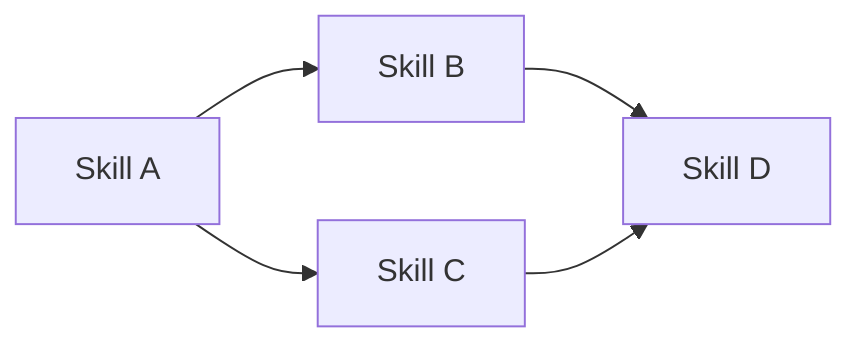
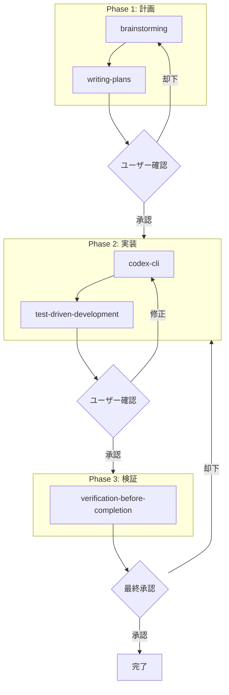

# workflow-designer リファレンス

## 1. ワークフロー定義スキーマ

```yaml
workflow:
  name: string                    # ワークフロー名
  version: string                 # バージョン
  description: string             # 説明

  goal:
    description: string           # ゴール説明
    success_criteria:             # 成功基準リスト
      - string

  settings:
    checkpoint_level: enum        # phase_level/step_level/minimal
    max_total_attempts: int       # 全体の最大試行回数
    timeout_minutes: int          # タイムアウト
    estimated_time: string        # 推定所要時間

  phases:
    - name: string
      steps:
        - id: string
          skill: string
          params: object
          depends_on: [string]
          condition: string       # 条件式（オプション）
          checkpoint: enum        # approval/review/notification/none
          error_handling:
            on_failure:
              retry: int
              fallback: string
              escalate: enum
            on_stuck:
              threshold: int
              action: enum
              escalate: enum
      completion_criteria: string
      checkpoint: enum

  error_handling:
    global_fallback: string
    escalation_policy: enum
```

---

## 2. チェックポイント詳細

### 2.1 チェックポイントタイプ

| タイプ | 説明 | ユーザーアクション | 自動進行 |
|--------|------|------------------|---------|
| `approval` | 明示的な承認が必要 | 承認/却下を選択 | No |
| `review` | 結果を確認、問題なければ進行 | 確認/修正指示 | Optional |
| `notification` | 通知のみ | なし | Yes |
| `none` | チェックポイントなし | なし | Yes |

### 2.2 粒度設定 (checkpoint_level enum)

| 値 | 説明 | 確認タイミング |
|----|------|---------------|
| `phase_level` | フェーズ単位 | 各フェーズ完了後 |
| `step_level` | ステップ単位 | 各Skill実行後 |
| `minimal` | 最小限 | クリティカルな分岐点のみ |

**フェーズ単位 (`phase_level`)**
```
Phase 1 → [checkpoint] → Phase 2 → [checkpoint] → Phase 3
```

**ステップ単位 (`step_level`)**
```
Step 1.1 → [checkpoint] → Step 1.2 → [checkpoint] → ...
```

**最小限 (`minimal`)**
```
クリティカルな分岐点のみ（例: 実装前承認、最終承認）
```

---

## 3. 依存関係パターン

### 3.1 シーケンシャル（直列）


```yaml
steps:
  - id: a
    skill: skill_a
  - id: b
    skill: skill_b
    depends_on: [a]
  - id: c
    skill: skill_c
    depends_on: [b]
```

### 3.2 パラレル（並列）



```yaml
steps:
  - id: a
    skill: skill_a
  - id: b
    skill: skill_b
    depends_on: [a]
  - id: c
    skill: skill_c
    depends_on: [a]
  - id: d
    skill: skill_d
    depends_on: [b, c]  # 両方完了後に実行
```

### 3.3 条件分岐

```yaml
steps:
  - id: check
    skill: verification
  - id: success_path
    skill: finalize
    depends_on: [check]
    condition: "check.result == 'success'"
  - id: failure_path
    skill: debug
    depends_on: [check]
    condition: "check.result == 'failure'"
```

---

## 4. エラーハンドリングパターン

### 4.1 基本パターン

```yaml
error_handling:
  on_failure:
    retry: 2                # 2回まで再試行
    fallback: null          # フォールバックなし
    escalate: user          # ユーザーに通知
```

### 4.2 フォールバック付き

```yaml
error_handling:
  on_failure:
    retry: 1
    fallback: alternative_skill  # 代替 Skill
    escalate: user               # フォールバックも失敗時
```

### 4.3 スタック検出

```yaml
error_handling:
  on_stuck:
    threshold: 3            # 同一エラー3回でスタック判定
    action: pause           # 一時停止
    escalate: user          # ユーザーに介入要請
```

---

## 5. 利用可能な Skills 一覧

### Engineering

| Skill | 用途 |
|-------|------|
| `codex-cli` | コード生成、マルチエージェント連携 |
| `test-driven-development` | TDD 強制 |
| `systematic-debugging` | デバッグ、根本原因分析 |
| `verification-before-completion` | 完了前検証 |
| `brainstorming` | 協調的設計 |
| `writing-plans` | 計画書作成 |
| `executing-plans` | 計画実行 |
| `subagent-driven-development` | サブエージェント駆動 |
| `dispatching-parallel-agents` | 並列エージェント |
| `using-git-worktrees` | Git worktree |
| `docx`, `pdf`, `pptx`, `xlsx` | ドキュメント処理 |
| `playwright` | ブラウザ自動化 |

### PM

| Skill | 用途 |
|-------|------|
| `project-charter` | プロジェクト憲章 |
| `requirements` | 要件定義 |
| `risk-register` | リスク登録簿 |
| `weekly-status` | 週次レポート |
| `meeting-minutes` | 議事録 |

---

## 6. ワークフロー実行例

### 6.1 開発ワークフロー実行

```markdown
## ワークフロー実行ログ

### Phase 1: 計画
- [x] brainstorming → 完了 (5分)
- [x] writing-plans → 完了 (10分)
- [✓] ユーザー確認: 計画承認 → 承認

### Phase 2: 実装
- [x] codex-cli → 完了 (15分)
- [ ] test-driven-development → 実行中...
```

### 6.2 エラー発生時のフロー

```markdown
### Phase 2: 実装
- [x] codex-cli → 完了
- [!] test-driven-development → 失敗 (テスト失敗)
  - retry 1/2 → 失敗
  - retry 2/2 → 失敗
  - escalate → ユーザーに通知

**介入要請**: テストが失敗しています。以下の選択肢があります:
1. デバッグを開始する (systematic-debugging)
2. テスト要件を修正する
3. 手動で対応する
```

---

## 7. Mermaid フロー図生成

ワークフロー定義から自動生成:



---

## 8. トラブルシューティング

### Q: 循環依存が検出された

```
Error: Circular dependency detected: A → B → C → A
```

**対処**: 依存関係を見直し、循環を解消する

### Q: Skill が見つからない

```
Error: Skill 'unknown_skill' not found in .agent/skills/
```

**対処**: `.agent/registry.md` で利用可能な Skills を確認

### Q: タイムアウトが発生した

```
Warning: Workflow timeout (60 minutes) reached at Phase 2
```

**対処**:
1. `timeout_minutes` を増やす
2. ワークフローを分割する
3. 並列実行可能な部分を特定する
