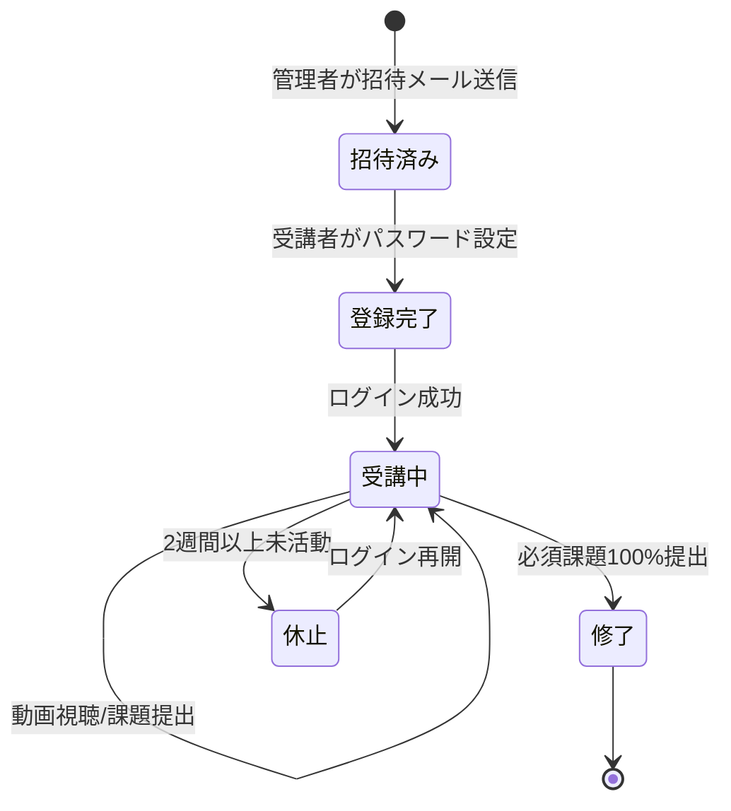
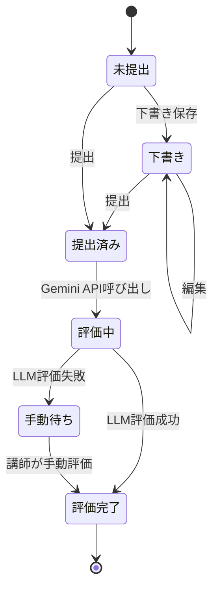
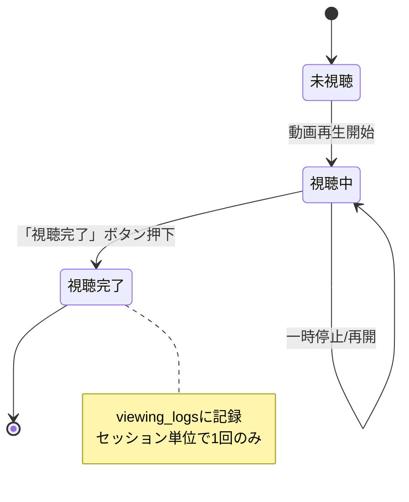

# アプリケーション仕様書

- プロジェクト名: AIポリテラシー育成プログラム Ver.2
- 更新日: 2026-01-05
- 版: v1.3（利用規約同意・コホート管理画面追加）
- 関連文書: ../docs/requirements.md (v2.0), db_schema.md, api_spec.md

---

## 1. 概要

### 1.1 アプリケーション目的

AIポリテラシー育成プログラムの受講者向けポータルおよび管理者向けダッシュボードを提供する専用Webアプリケーション。

### 1.2 主要機能

| 機能カテゴリ | 対象ユーザー | 概要 |
|---|---|---|
| 認証・アカウント管理 | 全ユーザー | メール+パスワード認証、パスワードリセット |
| 動画視聴・チェックイン | 受講者 | セッション動画視聴（2パート制：各約10分）、視聴完了記録 |
| 課題提出 | 受講者 | テキスト/URL/ファイルによる課題提出 |
| 評価結果閲覧 | 受講者 | LLM自動評価スコア・コメント確認 |
| 進捗ダッシュボード | 受講者 | 個人進捗率、提出状況、評価履歴 |
| 管理ダッシュボード | 管理者/講師 | 全受講者進捗、評価一覧 |
| 手動評価 | 講師 | フォールバック評価（API障害時） |
| レポート出力 | 管理者 | 助成金申請用エビデンス出力 |

### 1.3 技術スタック（推奨）

| レイヤー | 技術 | 備考 |
|---|---|---|
| フロントエンド | Next.js (App Router) | React Server Components対応 |
| スタイリング | Tailwind CSS | ユーティリティファースト |
| 認証 | NextAuth.js / Supabase Auth | メール+パスワード |
| バックエンド | Next.js API Routes / tRPC | 型安全なAPI |
| データベース | PostgreSQL (Supabase) | RLS対応 |
| LLM評価 | Gemini API (gemini-1.5-flash) | Structured Output |
| ファイルストレージ | Supabase Storage / S3 | 課題ファイル保存 |
| ホスティング | Vercel / Cloud Run | サーバーレス |

---

## 2. 画面一覧

### 2.1 公開画面（未認証）

| ID | 画面名 | パス | 概要 |
|---|---|---|---|
| P-01 | ランディングページ | `/` | プログラム紹介、ログインCTA |
| P-02 | ログイン | `/login` | メール+パスワード入力 |
| P-03 | パスワードリセット申請 | `/forgot-password` | メールアドレス入力 |
| P-04 | パスワードリセット実行 | `/reset-password` | 新パスワード設定 |
| P-05 | 新規登録（招待制） | `/register?token={token}` | 招待トークン経由のみ |
| P-06 | 利用規約同意 | `/terms-agreement` | 初回ログイン時の規約同意 |

### 2.2 受講者画面（認証必須）

| ID | 画面名 | パス | 概要 |
|---|---|---|---|
| S-01 | ダッシュボード | `/dashboard` | 進捗サマリー、次のアクション |
| S-02 | セッション一覧 | `/sessions` | 全セッション一覧、進捗状況 |
| S-03 | セッション詳細 | `/sessions/{id}` | 動画視聴、課題一覧 |
| S-04 | 動画視聴 | `/sessions/{id}/video/{part}` | 動画埋め込み、視聴完了ボタン |
| S-05 | 課題提出 | `/sessions/{id}/exercises/{exerciseId}` | 課題詳細、提出フォーム |
| S-06 | 提出履歴 | `/submissions` | 全提出履歴、評価結果 |
| S-07 | 評価詳細 | `/submissions/{id}` | 詳細スコア、コメント |
| S-08 | プロフィール | `/profile` | アカウント情報、パスワード変更 |

### 2.3 管理者画面（admin権限必須）

| ID | 画面名 | パス | 概要 |
|---|---|---|---|
| A-01 | 管理ダッシュボード | `/admin` | 全体統計、アラート一覧 |
| A-02 | 受講者一覧 | `/admin/learners` | 受講者検索、進捗一覧 |
| A-03 | 受講者詳細 | `/admin/learners/{id}` | 個人進捗、提出履歴 |
| A-04 | 提出一覧 | `/admin/submissions` | 全提出検索、フィルタ |
| A-05 | 評価キュー | `/admin/evaluation-queue` | 手動評価待ち一覧 |
| A-06 | 手動評価入力 | `/admin/submissions/{id}/evaluate` | スコア・コメント入力 |
| A-07 | セッション管理 | `/admin/sessions` | セッション・動画URL設定 |
| A-08 | 課題管理 | `/admin/exercises` | 課題・ルーブリック設定 |
| A-09 | 受講者招待 | `/admin/invite` | 招待メール送信 |
| A-10 | レポート出力 | `/admin/reports` | 助成金用CSV/PDF出力 |
| A-11 | 視聴ログ | `/admin/viewing-logs` | 視聴チェックイン履歴 |
| A-12 | コホート管理 | `/admin/cohorts` | 期別・企業別グループ管理 |

---

## 3. 画面詳細仕様

### 3.1 ログイン画面 (P-02)

**パス**: `/login`

**画面要素**:
```
┌─────────────────────────────────────┐
│         AIポリテラシー育成          │
│         プログラム                  │
│                                     │
│  ┌─────────────────────────────┐   │
│  │ メールアドレス              │   │
│  └─────────────────────────────┘   │
│  ┌─────────────────────────────┐   │
│  │ パスワード          [👁]   │   │
│  └─────────────────────────────┘   │
│                                     │
│  [       ログイン       ]           │
│                                     │
│  パスワードを忘れた方はこちら       │
└─────────────────────────────────────┘
```

**入力項目**:
| 項目 | 種別 | 必須 | バリデーション |
|---|---|---|---|
| メールアドレス | email | ✓ | 有効なメール形式 |
| パスワード | password | ✓ | 8文字以上 |

**アクション**:
| ボタン | 処理 | 遷移先 |
|---|---|---|
| ログイン | POST `/api/auth/login` | 成功: `/dashboard`、失敗: エラー表示 |
| パスワードリセット | リンク | `/forgot-password` |

**エラー表示**:
- メールアドレスまたはパスワードが正しくありません
- アカウントがロックされています（5回失敗後）

---

### 3.2 受講者ダッシュボード (S-01)

**パス**: `/dashboard`

**画面構成**:
```
┌─────────────────────────────────────────────────────────┐
│ [ロゴ]  セッション  提出履歴  プロフィール    [ログアウト] │
├─────────────────────────────────────────────────────────┤
│                                                         │
│  こんにちは、{ユーザー名}さん                           │
│                                                         │
│  ┌─────────────┐  ┌─────────────┐  ┌─────────────┐     │
│  │ 進捗率      │  │ 視聴完了    │  │ 必須課題    │     │
│  │   45%       │  │   6/12      │  │   8/12      │     │
│  └─────────────┘  └─────────────┘  └─────────────┘     │
│                                                         │
│  ─────────────────────────────────────────────────────  │
│  📌 次のアクション                                      │
│  ┌─────────────────────────────────────────────────┐   │
│  │ ⚠️ Session 4の課題「対話型プロンプト設計」が     │   │
│  │    未提出です                    [提出する →]   │   │
│  └─────────────────────────────────────────────────┘   │
│                                                         │
│  ─────────────────────────────────────────────────────  │
│  📊 最近の評価結果                                      │
│  ┌─────────────────────────────────────────────────┐   │
│  │ Session 3-Ex2: 業務報告メール作成    85点       │   │
│  │ Session 3-Ex1: 要約プロンプト        72点       │   │
│  │ Session 2-Ex3: 文脈設計              90点       │   │
│  └─────────────────────────────────────────────────┘   │
│                                                         │
└─────────────────────────────────────────────────────────┘
```

**表示データ**:
| 項目 | データソース | 更新タイミング |
|---|---|---|
| 進捗率 | (視聴完了+必須課題提出) / (12セッション+12必須課題) | リアルタイム |
| 視聴完了 | viewing_logs COUNT (12セッション) | ページロード時 |
| 必須課題 | submissions COUNT WHERE is_required=true (12課題) | ページロード時 |
| 次のアクション | 未提出必須課題、未視聴動画 | ページロード時 |
| 最近の評価 | evaluations ORDER BY created_at DESC LIMIT 3 | ページロード時 |

> **修了要件**: 視聴完了100%（12/12）+ 必須課題100%（12/12）+ 最終発表参加

**アクション**:
| 要素 | 遷移先 |
|---|---|
| 進捗率カード | `/sessions` |
| 視聴完了カード | `/sessions` |
| 課題提出カード | `/submissions` |
| 次のアクション[提出する] | `/sessions/{id}/exercises/{exerciseId}` |
| 評価結果行 | `/submissions/{id}` |

---

### 3.3 セッション詳細画面 (S-03)

**パス**: `/sessions/{id}`

**画面構成**:
```
┌─────────────────────────────────────────────────────────┐
│ ← セッション一覧                                        │
├─────────────────────────────────────────────────────────┤
│                                                         │
│  Session 3: 対話型プロンプトの基礎                      │
│  Phase 1 - プロンプトエンジニアリング基礎               │
│                                                         │
│  ─────────────────────────────────────────────────────  │
│  🎬 動画（2パート制）                                   │
│  ┌─────────────────────────────────────────────────┐   │
│  │ ☑ Part 3-1: 理論編 (約10分)          [視聴済]  │   │
│  │ ☐ Part 3-2: 実践編 (約10分)          [視聴する]│   │
│  └─────────────────────────────────────────────────┘   │
│                                                         │
│  ─────────────────────────────────────────────────────  │
│  📝 課題                                                │
│  ┌─────────────────────────────────────────────────┐   │
│  │ ☑ EX-05: 改善ループ実践 [必須]       72点 提出済│   │
│  │ ☐ EX-06: 要件定義→実行プロンプト [任意]  [提出]│   │
│  └─────────────────────────────────────────────────┘   │
│                                                         │
│  ─────────────────────────────────────────────────────  │
│  📚 補足資料                                            │
│  • プロンプトテンプレート集 (PDF)                       │
│  • 参考リンク集                                         │
│                                                         │
└─────────────────────────────────────────────────────────┘
```

**表示ロジック**:
- 各セッション2パート構成（Part X-1: 理論編 約10分、Part X-2: 実践編 約10分）
- 課題は該当セッション開始後に表示
- 必須課題（Part X-1対応）は常に表示、任意課題（Part X-2対応）は折りたたみ可
- Session 0は1本（約10分）のオリエンテーション動画

> **課題分類**: 必須課題12個（各Session 1課題）+ 任意課題12個（Type A向け深掘り）
> Session 12-13は「最終課題」として1セッション扱い（EX-23〜26は全て必須）

---

### 3.4 課題提出画面 (S-05)

**パス**: `/sessions/{id}/exercises/{exerciseId}`

**画面構成**:
```
┌─────────────────────────────────────────────────────────┐
│ ← Session 3に戻る                                       │
├─────────────────────────────────────────────────────────┤
│                                                         │
│  📝 Ex 2: 業務報告メール作成 [必須]                     │
│                                                         │
│  ─────────────────────────────────────────────────────  │
│  課題内容                                               │
│  以下の要件を満たすプロンプトを作成してください：       │
│  1. 週次業務報告メールを生成するプロンプト              │
│  2. 報告項目: 今週の成果、来週の予定、課題・相談事項    │
│  3. 500文字以内で簡潔にまとめる指示を含める             │
│                                                         │
│  ─────────────────────────────────────────────────────  │
│  評価観点                                               │
│  • 基本要素（役割、目的、制約）: 25点                   │
│  • 実用性: 25点                                         │
│  • 創意工夫: 25点                                       │
│  • 完成度: 25点                                         │
│                                                         │
│  ─────────────────────────────────────────────────────  │
│  回答を入力                                             │
│  ┌─────────────────────────────────────────────────┐   │
│  │ あなたは経験豊富なビジネスライターです。          │   │
│  │ 以下の情報をもとに、週次業務報告メールを作成し   │   │
│  │ てください...                                     │   │
│  │                                                   │   │
│  │                                                   │   │
│  └─────────────────────────────────────────────────┘   │
│                                      文字数: 245/2000  │
│                                                         │
│  ┌─────────────────────────────────────────────────┐   │
│  │ 📎 ファイルを添付（任意）                        │   │
│  │    ドラッグ&ドロップまたはクリックで選択         │   │
│  └─────────────────────────────────────────────────┘   │
│                                                         │
│  [下書き保存]                    [      提出する      ] │
│                                                         │
│  💡 提出後も再提出できます。最新の提出が評価対象です。  │
│                                                         │
└─────────────────────────────────────────────────────────┘
```

**入力項目**:
| 項目 | 種別 | 必須 | バリデーション |
|---|---|---|---|
| 回答テキスト | textarea | ✓ | 10〜2000文字 |
| 添付ファイル | file | - | 10MB以下、PDF/PNG/JPG/TXT |

**アクション**:
| ボタン | 処理 | 遷移先 |
|---|---|---|
| 下書き保存 | PUT `/api/exercises/{exercise_id}/draft` | 現在画面（保存完了トースト） |
| 提出する | POST `/api/submissions` | 確認モーダル → `/submissions/{id}` |

**提出確認モーダル**:
```
┌─────────────────────────────────────┐
│  提出確認                           │
│                                     │
│  この内容で提出しますか？           │
│  再提出も可能です（最新が評価対象）。│
│                                     │
│  [キャンセル]      [提出する]       │
└─────────────────────────────────────┘
```

---

### 3.5 評価詳細画面 (S-07)

**パス**: `/submissions/{id}`

**画面構成**:
```
┌─────────────────────────────────────────────────────────┐
│ ← 提出履歴                                              │
├─────────────────────────────────────────────────────────┤
│                                                         │
│  Session 3 - Ex 2: 業務報告メール作成                   │
│  提出日時: 2026-01-15 14:32                             │
│                                                         │
│  ─────────────────────────────────────────────────────  │
│  📊 評価結果                                            │
│  ┌─────────────────────────────────────────────────┐   │
│  │           総合スコア: 85 / 100                   │   │
│  │  ┌───────────────────────────────────────────┐  │   │
│  │  │ 基本要素    ████████████████████░░  20/25 │  │   │
│  │  │ 実用性      █████████████████████░  22/25 │  │   │
│  │  │ 創意工夫    ████████████████████░░  20/25 │  │   │
│  │  │ 完成度      ███████████████████████ 23/25 │  │   │
│  │  └───────────────────────────────────────────┘  │   │
│  └─────────────────────────────────────────────────┘   │
│                                                         │
│  ─────────────────────────────────────────────────────  │
│  💬 フィードバック                                      │
│  ┌─────────────────────────────────────────────────┐   │
│  │ ✅ 良い点                                        │   │
│  │ • 役割設定が明確で、ビジネスライターとしての     │   │
│  │   専門性を活かした指示になっています             │   │
│  │ • 出力形式（箇条書き、文字数制限）が具体的       │   │
│  │                                                   │   │
│  │ 📈 改善点                                        │   │
│  │ • 報告の対象読者（上司、チーム）を明示すると     │   │
│  │   より適切なトーンで出力できます                 │   │
│  │                                                   │   │
│  │ 🎯 次のステップ                                  │   │
│  │ Session 4では対話型プロンプトを学びます。        │   │
│  │ 今回の報告メールを対話形式で洗練させる練習を    │   │
│  │ してみましょう。                                 │   │
│  └─────────────────────────────────────────────────┘   │
│                                                         │
│  ─────────────────────────────────────────────────────  │
│  📄 提出内容                                            │
│  ┌─────────────────────────────────────────────────┐   │
│  │ あなたは経験豊富なビジネスライターです。          │   │
│  │ 以下の情報をもとに、週次業務報告メールを作成...  │   │
│  └─────────────────────────────────────────────────┘   │
│                                                         │
└─────────────────────────────────────────────────────────┘
```

---

### 3.6 管理者ダッシュボード (A-01)

**パス**: `/admin`

**画面構成**:
```
┌─────────────────────────────────────────────────────────┐
│ [ロゴ] 受講者 提出 評価キュー セッション レポート        │
├─────────────────────────────────────────────────────────┤
│                                                         │
│  📊 全体統計                                            │
│  ┌─────────┐ ┌─────────┐ ┌─────────┐                   │
│  │受講者数 │ │平均進捗 │ │提出数   │                   │
│  │  24名   │ │  62%    │ │ 312件   │                   │
│  └─────────┘ └─────────┘ └─────────┘                   │
│                                                         │
│  ─────────────────────────────────────────────────────  │
│  🚨 要対応アラート                                      │
│  ┌─────────────────────────────────────────────────┐   │
│  │ ⚠️ 手動評価待ち: 2件             [対応する →]  │   │
│  │ ⚠️ 3日以上未提出者: 5名          [確認する →]  │   │
│  └─────────────────────────────────────────────────┘   │
│                                                         │
│  ─────────────────────────────────────────────────────  │
│  📈 Session別進捗                                       │
│  ┌─────────────────────────────────────────────────┐   │
│  │ S1  ████████████████████████████████████  100%  │   │
│  │ S2  ██████████████████████████████░░░░░░   85%  │   │
│  │ S3  █████████████████████████░░░░░░░░░░░   70%  │   │
│  │ S4  ████████████████░░░░░░░░░░░░░░░░░░░░   45%  │   │
│  │ S5  ██████░░░░░░░░░░░░░░░░░░░░░░░░░░░░░░   20%  │   │
│  └─────────────────────────────────────────────────┘   │
│                                                         │
│  ─────────────────────────────────────────────────────  │
│  📋 最近の提出                                          │
│  ┌─────────────────────────────────────────────────┐   │
│  │ 受講者A  S4-Ex1  2026-01-15 15:02  評価済 78点  │   │
│  │ 受講者B  S4-Ex2  2026-01-15 14:45  評価済 92点  │   │
│  │ 受講者C  S3-Ex3  2026-01-15 14:30  手動待ち     │   │
│  └─────────────────────────────────────────────────┘   │
│                                                         │
└─────────────────────────────────────────────────────────┘
```

---

### 3.7 手動評価入力画面 (A-06)

**パス**: `/admin/submissions/{id}/evaluate`

**画面構成**:
```
┌─────────────────────────────────────────────────────────┐
│ ← 評価キューに戻る                                      │
├─────────────────────────────────────────────────────────┤
│                                                         │
│  手動評価: 受講者C - S3-Ex3                             │
│  提出日時: 2026-01-15 14:30                             │
│  理由: API評価タイムアウト                              │
│                                                         │
│  ─────────────────────────────────────────────────────  │
│  📄 提出内容                                            │
│  ┌─────────────────────────────────────────────────┐   │
│  │ （受講者の提出テキスト）                          │   │
│  └─────────────────────────────────────────────────┘   │
│                                                         │
│  ─────────────────────────────────────────────────────  │
│  📊 評価入力                                            │
│                                                         │
│  総合スコア: [____] / 100                               │
│                                                         │
│  内訳:                                                  │
│  基本要素:    [____] / 25                               │
│  実用性:      [____] / 25                               │
│  創意工夫:    [____] / 25                               │
│  完成度:      [____] / 25                               │
│                                                         │
│  良い点（1-3点）:                                       │
│  ┌─────────────────────────────────────────────────┐   │
│  │                                                   │   │
│  └─────────────────────────────────────────────────┘   │
│                                                         │
│  改善点（1-3点）:                                       │
│  ┌─────────────────────────────────────────────────┐   │
│  │                                                   │   │
│  └─────────────────────────────────────────────────┘   │
│                                                         │
│  次のステップ:                                          │
│  ┌─────────────────────────────────────────────────┐   │
│  │                                                   │   │
│  └─────────────────────────────────────────────────┘   │
│                                                         │
│  [下書き保存]                    [評価を確定する]       │
│                                                         │
└─────────────────────────────────────────────────────────┘
```

---

## 4. 状態遷移図

### 4.1 受講者ライフサイクル



### 4.2 課題提出フロー



### 4.3 視聴チェックインフロー



---

## 5. 認証・認可

### 5.1 認証方式

| 項目 | 仕様 |
|---|---|
| 認証方式 | メールアドレス + パスワード |
| セッション管理 | JWT（有効期限: 7日） |
| リフレッシュトークン | 30日（自動延長） |
| パスワード要件 | 8文字以上、英数混合推奨 |
| アカウントロック | 5回連続失敗で30分ロック |

### 5.2 ロール定義

| ロール | 権限 | 対象画面 |
|---|---|---|
| learner | 自分のデータのみ閲覧・提出 | S-01〜S-09 |
| instructor | 全受講者データ閲覧・評価 | A-01〜A-08 |
| admin | 全機能（設定含む） | 全画面 |

### 5.3 RLS（Row Level Security）ポリシー

```sql
-- 受講者は自分のデータのみアクセス可能
CREATE POLICY learner_own_data ON submissions
    FOR ALL
    USING (user_id = auth.uid() OR auth.jwt() ->> 'role' IN ('instructor', 'admin'));

-- 評価結果も同様
CREATE POLICY learner_own_evaluations ON evaluations
    FOR SELECT
    USING (
        submission_id IN (
            SELECT id FROM submissions WHERE user_id = auth.uid()
        )
        OR auth.jwt() ->> 'role' IN ('instructor', 'admin')
    );
```

---

## 6. レスポンシブ対応

### 6.1 ブレイクポイント

| 名称 | 幅 | 対象デバイス |
|---|---|---|
| sm | 640px〜 | スマートフォン（横） |
| md | 768px〜 | タブレット |
| lg | 1024px〜 | ノートPC |
| xl | 1280px〜 | デスクトップ |

### 6.2 モバイル対応方針

- 受講者画面（S-*）: モバイルファースト設計
- 管理者画面（A-*）: タブレット以上推奨（md〜）
- 動画視聴: 横画面推奨、縦画面でも視聴可能

---

## 7. パフォーマンス要件

| 指標 | 目標値 | 備考 |
|---|---|---|
| 初回ロード（LCP） | 2.5秒以下 | Core Web Vitals |
| インタラクション（INP） | 200ms以下 | Core Web Vitals |
| レイアウトシフト（CLS） | 0.1以下 | Core Web Vitals |
| API応答時間 | 500ms以下 | 95パーセンタイル |
| LLM評価完了 | 10分以内 | Gemini API含む |

---

## 8. 修了要件

### 8.1 修了判定基準

| 要件 | 基準 | 計算ロジック |
|---|---|---|
| 動画視聴率 | **100%** | viewing_logs COUNT = 12 |
| 必須課題提出率 | **100%** | submissions COUNT WHERE is_required=true = 12 |
| 最終発表 | 参加必須 | final_presentation_attended = true |

> 任意課題（12課題）は修了要件に含まない

### 8.2 課題分類

| Phase | 必須課題 | 任意課題 | 備考 |
|---|---|---|---|
| 1（Session 1-3） | EX-01, 03, 05 | EX-02, 04, 06 | プロンプト基礎 |
| 2（Session 4-5） | EX-07, 09 | EX-08, 10 | メタプロンプト |
| 3（Session 6-10） | EX-11, 13, 15, 17, 19 | EX-12, 14, 16, 18, 20 | GPTs構築 |
| 4（Session 11-13） | EX-21, 23, 24, 25, 26 | EX-22 | 業務GPTs実運用 |

> **最終課題（EX-23〜26）**: Session 12-13は2週間の最終課題期間。4成果物すべて必須。

### 8.3 最終課題の提出形式

| 提出項目 | 提出方式 | 形式 | 備考 |
|---|---|---|---|
| EX-23: GPTs設計書 | 個別提出 | テキスト/PDF | 対象業務・要件・設計書 |
| EX-24: GPTs実装＋運用ログ | 個別提出 | URL + ログファイル | GPTsリンク＋使用ログ5件以上 |
| EX-25: 振り返りレポート | 個別提出 | テキスト/PDF | フィードバック＋改善記録 |
| EX-26: 最終発表資料 | 個別提出 | PDF/動画ファイル | 発表スライド＋発表動画（任意） |

> **提出・判定ロジック**:
> - DBでは4つの個別提出レコードとして管理（submissions テーブル）
> - 修了判定時は「EX-23〜26全て提出済み」で「最終課題完了」として**1課題**カウント
> - 進捗表示: 「最終課題 4/4 提出済み」のように内訳を表示

### 8.4 進捗計算

```javascript
// 進捗率の計算
const viewingProgress = completedViewings / 12;  // 12セッション
const exerciseProgress = completedRequired / 12; // 12必須課題
const overallProgress = (viewingProgress + exerciseProgress) / 2;

// 修了判定
const isCompleted =
  viewingProgress === 1.0 &&
  exerciseProgress === 1.0 &&
  finalPresentationAttended;
```

---

## 9. アクセシビリティ

| 項目 | 対応 |
|---|---|
| キーボード操作 | 全機能対応 |
| スクリーンリーダー | ARIA属性付与 |
| コントラスト比 | WCAG 2.1 AA準拠（4.5:1以上） |
| フォーカス表示 | 明確なフォーカスリング |

---

## 承認

| 役割 | 氏名 | 承認日 |
|---|---|---|
| プログラムマネージャー | AI-PgM | 2026-01-05 |
| 開発リード | - | - |
| UI/UXデザイナー | - | - |

---

## 変更履歴

| 日付 | 版 | 変更内容 |
|---|---|---|
| 2026-01-03 | v1.0 | 初版作成 |
| 2026-01-05 | v1.1 | 2パート制対応（動画10分×2）、修了要件セクション追加、課題分類（必須/任意）明確化 |
| 2026-01-05 | v1.2 | 下書きAPI識別子修正、最終課題提出形式明確化 |
| 2026-01-05 | v1.3 | P-06（利用規約同意）、A-12（コホート管理）画面追加 |
