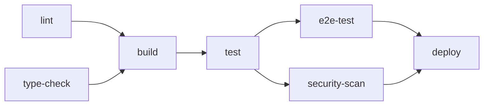

# CI/CD パイプライン詳細設計

- プロジェクト名: AIポリテラシー育成プログラム Ver.2
- 作成日: 2026-01-06
- 版: v1.0
- 関連文書: infrastructure_spec.md, deployment_guide.md, test_plan.md

---

## 1. パイプライン概要

### 1.1 ワークフロー全体図

```
┌─────────────────────────────────────────────────────────────────────────┐
│                          CI/CD パイプライン                              │
├─────────────────────────────────────────────────────────────────────────┤
│                                                                          │
│  ┌──────────┐   ┌──────────┐   ┌──────────┐   ┌──────────┐             │
│  │  Push/PR │──▶│   Lint   │──▶│   Test   │──▶│  Build   │             │
│  └──────────┘   │  & Type  │   │  (Unit)  │   │          │             │
│                 └──────────┘   └──────────┘   └────┬─────┘             │
│                                                    │                    │
│                 ┌──────────────────────────────────┘                    │
│                 ▼                                                        │
│  ┌──────────────────────┐   ┌──────────────────────┐                   │
│  │    E2E Test          │   │   Security Scan      │                   │
│  │   (Playwright)       │   │   (npm audit)        │                   │
│  └──────────┬───────────┘   └──────────┬───────────┘                   │
│             │                          │                                │
│             └──────────┬───────────────┘                                │
│                        ▼                                                 │
│  ┌─────────────────────────────────────────────────────────────────┐   │
│  │                         Deploy                                    │   │
│  │  PR → Preview | develop → Staging | main → Production            │   │
│  └─────────────────────────────────────────────────────────────────┘   │
│                                                                          │
└─────────────────────────────────────────────────────────────────────────┘
```

### 1.2 トリガー条件

| イベント | ブランチ | 実行ワークフロー |
|---|---|---|
| `push` | `main` | CI + E2E + Production Deploy |
| `push` | `develop` | CI + E2E + Staging Deploy |
| `pull_request` | `main`, `develop` | CI + E2E + Preview Deploy |
| `schedule` | - | 日次セキュリティスキャン |

### 1.3 ジョブ依存関係



---

## 2. Lint & Type Check ジョブ

### 2.1 ESLint 設定

```javascript
// eslint.config.mjs
import eslint from '@eslint/js';
import tseslint from 'typescript-eslint';
import nextPlugin from '@next/eslint-plugin-next';
import reactPlugin from 'eslint-plugin-react';
import reactHooksPlugin from 'eslint-plugin-react-hooks';

export default tseslint.config(
  eslint.configs.recommended,
  ...tseslint.configs.recommended,
  {
    plugins: {
      '@next/next': nextPlugin,
      'react': reactPlugin,
      'react-hooks': reactHooksPlugin,
    },
    rules: {
      '@typescript-eslint/no-unused-vars': ['error', { argsIgnorePattern: '^_' }],
      '@typescript-eslint/explicit-function-return-type': 'off',
      '@typescript-eslint/no-explicit-any': 'warn',
      'react-hooks/rules-of-hooks': 'error',
      'react-hooks/exhaustive-deps': 'warn',
    },
  },
  {
    ignores: ['.next/', 'node_modules/', 'coverage/', 'playwright-report/'],
  }
);
```

### 2.2 Prettier 設定

```json
// .prettierrc
{
  "semi": true,
  "trailingComma": "es5",
  "singleQuote": true,
  "tabWidth": 2,
  "printWidth": 100,
  "plugins": ["prettier-plugin-tailwindcss"]
}
```

### 2.3 TypeScript 設定

```json
// tsconfig.json（抜粋）
{
  "compilerOptions": {
    "strict": true,
    "noUncheckedIndexedAccess": true,
    "noImplicitReturns": true,
    "noFallthroughCasesInSwitch": true
  }
}
```

---

## 3. 単体テストジョブ

### 3.1 Vitest 設定

```typescript
// vitest.config.ts
import { defineConfig } from 'vitest/config';
import react from '@vitejs/plugin-react';
import path from 'path';

export default defineConfig({
  plugins: [react()],
  test: {
    environment: 'jsdom',
    globals: true,
    setupFiles: ['./tests/setup.ts'],
    coverage: {
      provider: 'v8',
      reporter: ['text', 'json', 'html', 'lcov'],
      exclude: [
        'node_modules/',
        '.next/',
        '**/*.d.ts',
        '**/*.config.*',
        '**/types/**',
      ],
      thresholds: {
        lines: 80,
        functions: 80,
        branches: 80,
        statements: 80,
      },
    },
  },
  resolve: {
    alias: {
      '@': path.resolve(__dirname, './src'),
    },
  },
});
```

### 3.2 テストセットアップ

```typescript
// tests/setup.ts
import '@testing-library/jest-dom';
import { vi } from 'vitest';

// Mock Next.js router
vi.mock('next/navigation', () => ({
  useRouter: () => ({
    push: vi.fn(),
    replace: vi.fn(),
    back: vi.fn(),
  }),
  usePathname: () => '/',
  useSearchParams: () => new URLSearchParams(),
}));

// Mock Supabase
vi.mock('@/lib/supabase/client', () => ({
  createClient: () => ({
    auth: {
      getUser: vi.fn(),
      signIn: vi.fn(),
      signOut: vi.fn(),
    },
    from: vi.fn(() => ({
      select: vi.fn().mockReturnThis(),
      insert: vi.fn().mockReturnThis(),
      update: vi.fn().mockReturnThis(),
      delete: vi.fn().mockReturnThis(),
      eq: vi.fn().mockReturnThis(),
    })),
  }),
}));
```

### 3.3 カバレッジ閾値

| 指標 | 閾値 | 備考 |
|---|---|---|
| Lines | 80% | 行カバレッジ |
| Functions | 80% | 関数カバレッジ |
| Branches | 80% | 分岐カバレッジ |
| Statements | 80% | 文カバレッジ |

---

## 4. E2E テストジョブ（Playwright）

### 4.1 Playwright 設定

```typescript
// playwright.config.ts
import { defineConfig, devices } from '@playwright/test';

export default defineConfig({
  testDir: './tests/e2e',
  fullyParallel: true,
  forbidOnly: !!process.env.CI,
  retries: process.env.CI ? 2 : 0,
  workers: process.env.CI ? 1 : undefined,
  reporter: [
    ['html', { open: 'never' }],
    ['json', { outputFile: 'playwright-report/results.json' }],
    ['github'],
  ],
  use: {
    baseURL: process.env.BASE_URL || 'http://localhost:3000',
    trace: 'on-first-retry',
    screenshot: 'only-on-failure',
    video: 'on-first-retry',
  },
  projects: [
    {
      name: 'chromium',
      use: { ...devices['Desktop Chrome'] },
    },
    {
      name: 'firefox',
      use: { ...devices['Desktop Firefox'] },
    },
    {
      name: 'webkit',
      use: { ...devices['Desktop Safari'] },
    },
    {
      name: 'Mobile Chrome',
      use: { ...devices['Pixel 5'] },
    },
  ],
  webServer: process.env.CI
    ? undefined
    : {
        command: 'npm run dev',
        url: 'http://localhost:3000',
        reuseExistingServer: !process.env.CI,
      },
});
```

### 4.2 E2E テスト例

```typescript
// tests/e2e/auth.spec.ts
import { test, expect } from '@playwright/test';

test.describe('認証フロー', () => {
  test('ログインが成功する', async ({ page }) => {
    await page.goto('/login');

    await page.fill('input[name="email"]', 'admin@example.com');
    await page.fill('input[name="password"]', 'admin123');
    await page.click('button[type="submit"]');

    await expect(page).toHaveURL('/admin');
    await expect(page.locator('h1')).toContainText('ダッシュボード');
  });

  test('無効な認証情報でエラーが表示される', async ({ page }) => {
    await page.goto('/login');

    await page.fill('input[name="email"]', 'invalid@example.com');
    await page.fill('input[name="password"]', 'wrongpassword');
    await page.click('button[type="submit"]');

    await expect(page.locator('[role="alert"]')).toContainText('認証に失敗しました');
  });
});
```

### 4.3 並列実行設定

| 環境 | Workers | リトライ |
|---|---|---|
| ローカル | 自動（CPU数） | 0 |
| CI | 1 | 2 |

---

## 5. セキュリティスキャン

### 5.1 npm audit

```yaml
- name: Security audit
  run: npm audit --audit-level=high
  continue-on-error: true
```

### 5.2 Dependabot 設定

```yaml
# .github/dependabot.yml
version: 2
updates:
  - package-ecosystem: "npm"
    directory: "/"
    schedule:
      interval: "weekly"
      day: "monday"
      time: "09:00"
      timezone: "Asia/Tokyo"
    open-pull-requests-limit: 10
    groups:
      production-dependencies:
        dependency-type: "production"
      development-dependencies:
        dependency-type: "development"
    ignore:
      - dependency-name: "*"
        update-types: ["version-update:semver-major"]
    labels:
      - "dependencies"
      - "automated"
```

### 5.3 CodeQL 設定

```yaml
# .github/workflows/codeql.yml
name: CodeQL Analysis

on:
  push:
    branches: [main, develop]
  pull_request:
    branches: [main, develop]
  schedule:
    - cron: '0 0 * * 1'

jobs:
  analyze:
    runs-on: ubuntu-latest
    permissions:
      actions: read
      contents: read
      security-events: write

    steps:
      - uses: actions/checkout@v4

      - name: Initialize CodeQL
        uses: github/codeql-action/init@v3
        with:
          languages: javascript-typescript

      - name: Perform CodeQL Analysis
        uses: github/codeql-action/analyze@v3
```

---

## 6. ビルド & デプロイジョブ

### 6.1 Vercel 連携

Vercel GitHub Integration により、以下が自動実行:
- PR作成 → Preview Deploy
- `develop` push → Staging Deploy
- `main` push → Production Deploy

### 6.2 デプロイ前チェック

```yaml
- name: Pre-deploy checks
  run: |
    # 環境変数チェック
    if [ -z "$NEXT_PUBLIC_SUPABASE_URL" ]; then
      echo "Error: NEXT_PUBLIC_SUPABASE_URL is not set"
      exit 1
    fi

    # ビルド確認
    npm run build
```

---

## 7. ワークフロー設定ファイル

### 7.1 メインワークフロー（ci.yml）

```yaml
# .github/workflows/ci.yml
name: CI

on:
  push:
    branches: [main, develop]
  pull_request:
    branches: [main, develop]

concurrency:
  group: ${{ github.workflow }}-${{ github.ref }}
  cancel-in-progress: true

env:
  NODE_VERSION: '20'

jobs:
  lint:
    name: Lint & Format
    runs-on: ubuntu-latest
    steps:
      - uses: actions/checkout@v4

      - name: Setup Node.js
        uses: actions/setup-node@v4
        with:
          node-version: ${{ env.NODE_VERSION }}
          cache: 'npm'

      - name: Install dependencies
        run: npm ci

      - name: Run ESLint
        run: npm run lint

      - name: Check formatting
        run: npm run format:check

  type-check:
    name: Type Check
    runs-on: ubuntu-latest
    steps:
      - uses: actions/checkout@v4

      - name: Setup Node.js
        uses: actions/setup-node@v4
        with:
          node-version: ${{ env.NODE_VERSION }}
          cache: 'npm'

      - name: Install dependencies
        run: npm ci

      - name: Generate Prisma Client
        run: npx prisma generate

      - name: Run type check
        run: npm run type-check

  test:
    name: Unit Tests
    runs-on: ubuntu-latest
    needs: [lint, type-check]
    steps:
      - uses: actions/checkout@v4

      - name: Setup Node.js
        uses: actions/setup-node@v4
        with:
          node-version: ${{ env.NODE_VERSION }}
          cache: 'npm'

      - name: Install dependencies
        run: npm ci

      - name: Generate Prisma Client
        run: npx prisma generate

      - name: Run tests
        run: npm run test -- --coverage
        env:
          NEXT_PUBLIC_SUPABASE_URL: ${{ secrets.SUPABASE_URL_TEST }}
          NEXT_PUBLIC_SUPABASE_ANON_KEY: ${{ secrets.SUPABASE_ANON_KEY_TEST }}

      - name: Upload coverage
        uses: codecov/codecov-action@v4
        with:
          token: ${{ secrets.CODECOV_TOKEN }}
          files: ./coverage/lcov.info
          fail_ci_if_error: false

  build:
    name: Build
    runs-on: ubuntu-latest
    needs: [test]
    steps:
      - uses: actions/checkout@v4

      - name: Setup Node.js
        uses: actions/setup-node@v4
        with:
          node-version: ${{ env.NODE_VERSION }}
          cache: 'npm'

      - name: Install dependencies
        run: npm ci

      - name: Generate Prisma Client
        run: npx prisma generate

      - name: Build
        run: npm run build
        env:
          NEXT_PUBLIC_SUPABASE_URL: ${{ secrets.SUPABASE_URL_TEST }}
          NEXT_PUBLIC_SUPABASE_ANON_KEY: ${{ secrets.SUPABASE_ANON_KEY_TEST }}

  security:
    name: Security Scan
    runs-on: ubuntu-latest
    needs: [test]
    steps:
      - uses: actions/checkout@v4

      - name: Setup Node.js
        uses: actions/setup-node@v4
        with:
          node-version: ${{ env.NODE_VERSION }}
          cache: 'npm'

      - name: Install dependencies
        run: npm ci

      - name: Run npm audit
        run: npm audit --audit-level=high
        continue-on-error: true

      - name: Run Snyk
        uses: snyk/actions/node@master
        continue-on-error: true
        env:
          SNYK_TOKEN: ${{ secrets.SNYK_TOKEN }}
```

### 7.2 E2E テストワークフロー（e2e.yml）

**重要: E2E テスト環境の分離方針**

| 環境 | 用途 | データ | 注意事項 |
|---|---|---|---|
| **E2E専用環境** | CI/CD E2Eテスト | テスト専用データ | 本番/Stagingとは分離 |
| **Staging** | 手動検証、UAT | 本番に近いデータ | E2Eテストでは使用しない |
| **Production** | 本番 | 本番データ | テスト禁止 |

```yaml
# .github/workflows/e2e.yml
name: E2E Tests

on:
  push:
    branches: [main, develop]
  pull_request:
    branches: [main, develop]

jobs:
  e2e:
    name: E2E Tests
    runs-on: ubuntu-latest
    timeout-minutes: 30
    # E2E専用環境を使用（Staging/Productionとは分離）
    environment: e2e-test
    steps:
      - uses: actions/checkout@v4

      - name: Setup Node.js
        uses: actions/setup-node@v4
        with:
          node-version: '20'
          cache: 'npm'

      - name: Install dependencies
        run: npm ci

      - name: Generate Prisma Client
        run: npx prisma generate

      - name: Install Playwright browsers
        run: npx playwright install --with-deps chromium

      # テストデータのリセット（各テスト実行前にクリーンな状態を保証）
      - name: Reset test data
        env:
          # Prisma は DATABASE_URL と DIRECT_URL の両方を参照する
          DATABASE_URL: ${{ secrets.E2E_DATABASE_URL }}
          DIRECT_URL: ${{ secrets.E2E_DIRECT_URL }}
        run: |
          echo "Resetting test data..."
          npx prisma db push --force-reset --accept-data-loss
          npx prisma db seed
          echo "Test data reset complete."

      - name: Run E2E tests
        run: npm run test:e2e -- --project=chromium
        env:
          # E2E専用環境のURL（Stagingとは別）
          BASE_URL: ${{ secrets.E2E_BASE_URL }}
          NEXT_PUBLIC_SUPABASE_URL: ${{ secrets.E2E_SUPABASE_URL }}
          NEXT_PUBLIC_SUPABASE_ANON_KEY: ${{ secrets.E2E_SUPABASE_ANON_KEY }}
          DATABASE_URL: ${{ secrets.E2E_DATABASE_URL }}

      - name: Upload test report
        uses: actions/upload-artifact@v4
        if: failure()
        with:
          name: playwright-report
          path: playwright-report/
          retention-days: 7

      - name: Upload test results
        uses: actions/upload-artifact@v4
        if: always()
        with:
          name: test-results
          path: test-results/
          retention-days: 7
```

**E2E環境セットアップ手順**:
1. Supabase で E2E 専用プロジェクト（`ai-politeracy-e2e`）を作成
2. Vercel で E2E 専用デプロイ（`e2e.ai-politeracy.example.com`）を設定
3. GitHub Environment `e2e-test` を作成し、専用シークレットを設定
4. テスト実行ごとにデータをリセットし、テスト間の干渉を防止

### 7.3 リリースワークフロー（release.yml）

```yaml
# .github/workflows/release.yml
name: Release

on:
  push:
    tags:
      - 'v*'

jobs:
  release:
    name: Create Release
    runs-on: ubuntu-latest
    permissions:
      contents: write
    steps:
      - uses: actions/checkout@v4
        with:
          fetch-depth: 0

      - name: Generate changelog
        id: changelog
        uses: orhun/git-cliff-action@v3
        with:
          config: cliff.toml
          args: --latest --strip header

      - name: Create Release
        uses: softprops/action-gh-release@v2
        with:
          body: ${{ steps.changelog.outputs.content }}
          draft: false
          prerelease: ${{ contains(github.ref, '-rc') || contains(github.ref, '-beta') }}
```

---

## 8. シークレット管理

### 8.1 GitHub Secrets 一覧

| シークレット名 | 用途 | 環境 |
|---|---|---|
| `SUPABASE_URL_TEST` | Supabase URL（単体テスト用モック） | CI |
| `SUPABASE_ANON_KEY_TEST` | Supabase Anon Key（単体テスト用モック） | CI |
| `E2E_BASE_URL` | E2E専用環境URL | e2e-test |
| `E2E_SUPABASE_URL` | E2E専用Supabase URL | e2e-test |
| `E2E_SUPABASE_ANON_KEY` | E2E専用Supabase Anon Key | e2e-test |
| `E2E_DATABASE_URL` | E2E専用DB接続（Pooler経由） | e2e-test |
| `E2E_DIRECT_URL` | E2E専用DB接続（直接、リセット用） | e2e-test |
| `STAGING_DATABASE_URL` | Staging DB接続 | staging |
| `STAGING_DIRECT_URL` | Staging DB直接接続 | staging |
| `PRODUCTION_DATABASE_URL` | Production DB接続 | production |
| `PRODUCTION_DIRECT_URL` | Production DB直接接続 | production |
| `CODECOV_TOKEN` | Codecov トークン | CI |
| `SNYK_TOKEN` | Snyk トークン | Security |
| `SLACK_WEBHOOK_URL` | Slack通知用Webhook | 通知 |

### 8.2 シークレット設定手順

1. GitHub リポジトリ → **Settings** → **Secrets and variables** → **Actions**
2. **New repository secret** をクリック
3. Name と Value を入力
4. **Add secret** をクリック

---

## 9. 障害時の対応

### 9.1 ワークフロー失敗通知

```yaml
# ワークフローの最後に追加
- name: Notify Slack on failure
  if: failure()
  uses: 8398a7/action-slack@v3
  with:
    status: ${{ job.status }}
    fields: repo,message,commit,author,action,workflow
    mention: 'here'
    if_mention: failure
  env:
    SLACK_WEBHOOK_URL: ${{ secrets.SLACK_WEBHOOK_URL }}
```

### 9.2 手動再実行

1. GitHub → **Actions** タブ
2. 失敗したワークフローを選択
3. **Re-run failed jobs** または **Re-run all jobs** をクリック

### 9.3 ワークフローのスキップ

コミットメッセージに以下を含めるとCIをスキップ:
- `[skip ci]`
- `[ci skip]`
- `[no ci]`

```bash
git commit -m "docs: README更新 [skip ci]"
```

---

## 10. メトリクス・監視

### 10.1 ワークフロー実行時間

| ジョブ | 目標時間 | 上限時間 |
|---|---|---|
| lint | 1分 | 3分 |
| type-check | 1分 | 3分 |
| test | 3分 | 10分 |
| build | 3分 | 10分 |
| e2e | 10分 | 30分 |
| **合計** | **18分** | **56分** |

### 10.2 成功率目標

| 指標 | 目標 |
|---|---|
| CI成功率 | 95%以上 |
| Flaky test率 | 5%以下 |
| 平均実行時間 | 20分以下 |

---

## 更新履歴

| 日付 | バージョン | 変更内容 |
|---|---|---|
| 2026-01-06 | v1.0 | 初版作成 |
| 2026-01-06 | v1.1 | E2E専用環境の分離、テストデータリセット機能、シークレット一覧更新 |
| 2026-01-06 | v1.2 | E2Eリセット手順にDATABASE_URL追加（Prisma schemaのurl解決に必要） |
