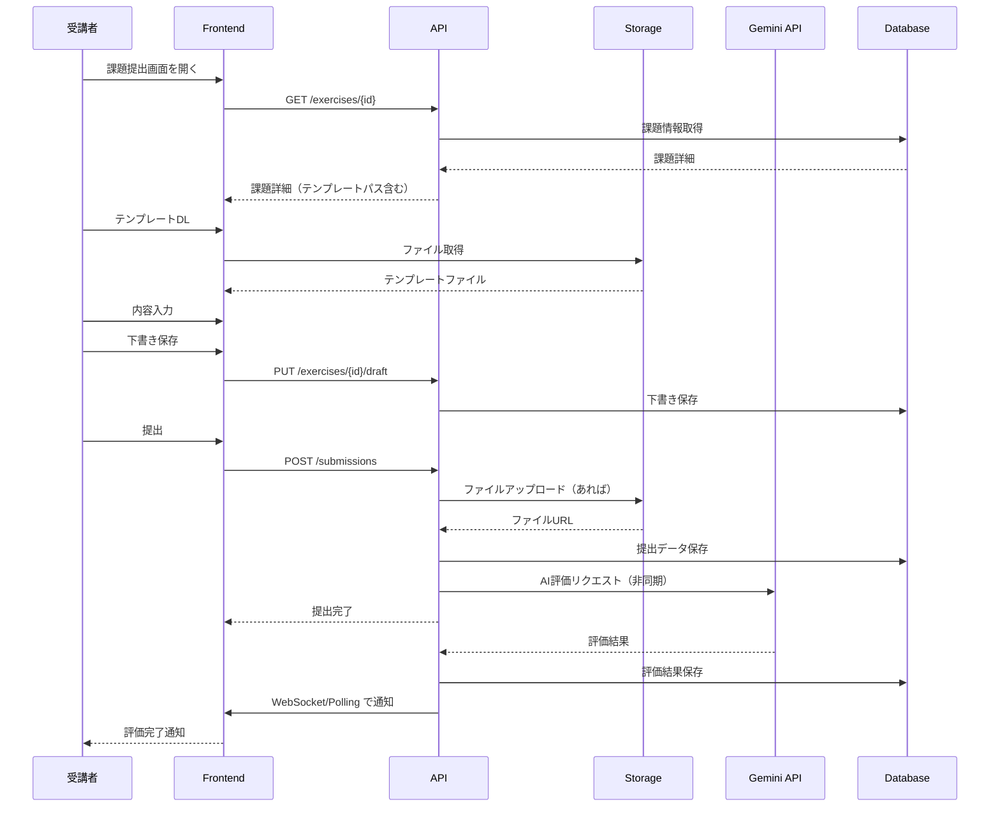
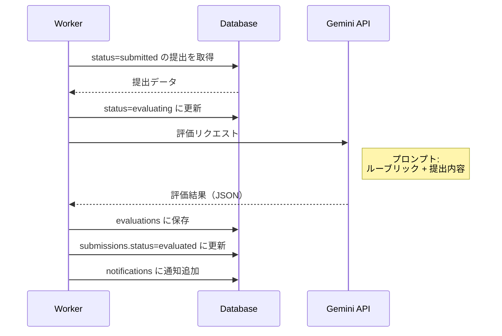

# 課題提出詳細設計書

- プロジェクト名: AIポリテラシー育成プログラム Ver.2
- 作成日: 2026-01-06
- 版: v1.0
- 関連文書: requirements_spec.md, app_spec.md, api_spec.md, db_schema.md, ../templates/

---

## 1. 概要

### 1.1 ドキュメントの目的

本書は、templates/ ディレクトリに定義された全26課題（EX-01〜EX-26）の提出仕様を開発チームが実装可能な形式で定義する。

### 1.2 課題と templates/ の対応

| Session | Week | Phase | 課題ID | 必須/任意 | テンプレートファイル |
|:---:|:---:|:---:|---|:---:|---|
| 1 | 1 | 1 | EX-01, EX-02 | 必須, 任意 | Session01_Templates.md |
| 2 | 2 | 1 | EX-03, EX-04 | 必須, 任意 | Session02_Templates.md |
| 3 | 3 | 1 | EX-05, EX-06 | 必須, 任意 | Session03_Templates.md |
| 4 | 4 | 1 | EX-07, EX-08 | 必須, 任意 | Session04_Templates.md |
| 5 | 5 | 2 | EX-09, EX-10 | 必須, 任意 | Session05_Templates.md |
| 6 | 6 | 2 | EX-11, EX-12 | 必須, 任意 | Session06_Templates.md |
| 7 | 7 | 3 | EX-13, EX-14 | 必須, 任意 | Session07_Templates.md |
| 8 | 8 | 3 | EX-15, EX-16 | 必須, 任意 | Session08_Templates.md |
| 9 | 9 | 3 | EX-17, EX-18 | 必須, 任意 | Session09_Templates.md |
| 10 | 10 | 3 | EX-19, EX-20 | 必須, 任意 | Session10_Templates.md |
| 11 | 11 | 4 | EX-21, EX-22 | 必須, 任意 | Session11_Templates.md |
| 12 | 12 | 4 | EX-23 | 必須 | Session12_Templates.md |
| 13 | 13 | 4 | EX-24, EX-25, EX-26 | 必須, 必須, 必須 | Session13_Templates.md |

**合計**: 必須15課題、任意11課題

---

## 2. 課題一覧と提出形式

### 2.1 Phase 1: プロンプトエンジニアリング基礎（Week 1-4）

#### Session 1: プロンプト基礎

| 課題ID | 課題名 | 必須/任意 | 提出形式 | 評価方式 |
|---|---|:---:|---|:---:|
| EX-01 | 4要素プロンプト作成 | 必須 | テキスト | AI自動 |
| EX-02 | Before/After比較 | 任意 | テキスト | AI自動 |

**EX-01 提出要件**:
- 4要素（指示・文脈・制約・出力形式）を含むプロンプト
- AIの応答結果
- 各要素の説明

**EX-02 提出要件**:
- Beforeプロンプトと応答
- Afterプロンプトと応答
- 改善ポイントの説明

#### Session 2: 文脈・制約・出力形式

| 課題ID | 課題名 | 必須/任意 | 提出形式 | 評価方式 |
|---|---|:---:|---|:---:|
| EX-03 | 文脈強化プロンプト | 必須 | テキスト | AI自動 |
| EX-04 | 制約条件実験 | 任意 | テキスト | AI自動 |

#### Session 3: 対話型プロンプト

| 課題ID | 課題名 | 必須/任意 | 提出形式 | 評価方式 |
|---|---|:---:|---|:---:|
| EX-05 | 対話型プロンプト設計 | 必須 | テキスト | AI自動 |
| EX-06 | 多段階対話実践 | 任意 | テキスト | AI自動 |

#### Session 4: 複合プロンプト

| 課題ID | 課題名 | 必須/任意 | 提出形式 | 評価方式 |
|---|---|:---:|---|:---:|
| EX-07 | 複合プロンプト作成 | 必須 | テキスト | AI自動 |
| EX-08 | ユースケース別プロンプト集 | 任意 | テキスト | AI自動 |

---

### 2.2 Phase 2: メタプロンプト（Week 5-6）

#### Session 5: メタプロンプト

| 課題ID | 課題名 | 必須/任意 | 提出形式 | 評価方式 |
|---|---|:---:|---|:---:|
| EX-09 | 汎用プロンプトテンプレート | 必須 | テキスト | AI自動 |
| EX-10 | 業務適用テンプレート | 任意 | テキスト | AI自動 |

**EX-09 提出要件**:
- 変数化されたテンプレート全文
- 変数定義シート
- 適用例（1件以上）

#### Session 6: GPTs企画

| 課題ID | 課題名 | 必須/任意 | 提出形式 | 評価方式 |
|---|---|:---:|---|:---:|
| EX-11 | GPTs企画書 | 必須 | テキスト | AI自動 |
| EX-12 | ペルソナ設計 | 任意 | テキスト | AI自動 |

---

### 2.3 Phase 3: GPTs構築（Week 7-10）

#### Session 7: Instructions設計

| 課題ID | 課題名 | 必須/任意 | 提出形式 | 評価方式 |
|---|---|:---:|---|:---:|
| EX-13 | Instructions作成 | 必須 | テキスト | AI自動 |
| EX-14 | プロンプトインジェクション対策 | 任意 | テキスト | AI自動 |

#### Session 8: 知識ベース構築

| 課題ID | 課題名 | 必須/任意 | 提出形式 | 評価方式 |
|---|---|:---:|---|:---:|
| EX-15 | 知識ベースファイル作成 | 必須 | ファイル | AI自動 |
| EX-16 | 知識ベース最適化 | 任意 | ファイル | AI自動 |

**EX-15/16 提出要件**:
- 知識ベースファイル（MD/JSON/TXT）
- ファイルサイズ上限: 10MB

#### Session 9: テスト・改善

| 課題ID | 課題名 | 必須/任意 | 提出形式 | 評価方式 |
|---|---|:---:|---|:---:|
| EX-17 | テストケース実行結果 | 必須 | テキスト | AI自動 |
| EX-18 | 改善ログ | 任意 | テキスト | AI自動 |

#### Session 10: GPTs仕様書完成

| 課題ID | 課題名 | 必須/任意 | 提出形式 | 評価方式 |
|---|---|:---:|---|:---:|
| EX-19 | GPTs仕様書 | 必須 | テキスト | AI自動 |
| EX-20 | 運用マニュアル | 任意 | テキスト | AI自動 |

---

### 2.4 Phase 4: 実践・最終課題（Week 11-13）

#### Session 11: 業務プロセス分析

| 課題ID | 課題名 | 必須/任意 | 提出形式 | 評価方式 |
|---|---|:---:|---|:---:|
| EX-21 | 業務分析シート | 必須 | テキスト | AI自動 |
| EX-22 | AI適用候補評価 | 任意 | テキスト | AI自動 |

#### Session 12: 最終課題（設計）

| 課題ID | 課題名 | 必須/任意 | 提出形式 | 評価方式 |
|---|---|:---:|---|:---:|
| EX-23 | GPTs設計書（最終課題） | 必須 | テキスト | 手動 |

**EX-23 提出要件**:
- 対象業務（業務基本情報、概要、課題、Session 11との接続）
- GPTs設計（概要、Instructions設計、知識ベース構成、成功基準）
- 実装計画（Week 12-13スケジュール、リスクと対策）

#### Session 13: 最終課題（実装・発表）

| 課題ID | 課題名 | 必須/任意 | 提出形式 | 評価方式 |
|---|---|:---:|---|:---:|
| EX-24 | GPTs実装＋運用ログ | 必須 | 複合 | 手動 |
| EX-25 | 振り返りレポート | 必須 | テキスト | 手動 |
| EX-26 | 最終発表資料 | 必須 | 複合 | 手動 |

**EX-24 提出要件**:
- 完成GPTs（Instructions + 知識ベース）
- 運用ログ（5回以上の使用記録）

**EX-25 提出要件**:
- フィードバック収集結果
- 改善実施記録（Before/After）

**EX-26 提出要件**:
- 発表スライド（10-15枚）
- 発表動画（任意・20分）または最終発表への参加

---

## 3. 提出形式仕様

### 3.1 提出タイプ定義

| タイプ | 説明 | 対応課題 | DB submission_type |
|---|---|---|---|
| テキスト | Markdown形式の本文入力 | EX-01〜14, 17〜23, 25 | text |
| ファイル | MD/JSON/TXT/PDF等のアップロード | EX-15, 16 | file |
| URL | 外部リソースへのリンク | （必要に応じて） | url |
| 複合 | テキスト + ファイル + URL | EX-24, 26 | mixed |

### 3.2 ファイルアップロード仕様

| 項目 | 仕様 |
|---|---|
| 最大ファイルサイズ | 10MB/件 |
| 許可拡張子 | .md, .json, .txt, .pdf, .png, .jpg, .pptx, .mp4 |
| 最大ファイル数 | 5件/提出 |
| ストレージ | Supabase Storage |
| パス形式 | `submissions/{user_id}/{exercise_id}/{timestamp}_{filename}` |

### 3.3 テキスト入力仕様

| 項目 | 仕様 |
|---|---|
| 形式 | Markdown |
| 最大文字数 | 50,000文字 |
| 最小文字数 | 100文字（必須課題） |
| エディタ | Monaco Editor（コードハイライト対応） |
| プレビュー | リアルタイムMarkdownプレビュー |

---

## 4. 評価仕様

### 4.1 評価方式

| 方式 | 対象課題 | 評価者 | 評価時間目安 |
|---|---|---|---|
| AI自動評価 | EX-01〜22 | Gemini 1.5 Pro | 1-2分 |
| 手動評価 | EX-23〜26 | instructor/admin | 即時〜3営業日 |

### 4.2 AI自動評価ルーブリック

4軸評価システム（各25点、合計100点）:

| 軸 | 観点 | 評価基準 |
|---|---|---|
| 要素網羅 | 必要な要素が含まれているか | 0-25点 |
| 実用性 | 実業務で使える内容か | 0-25点 |
| 創造性 | 独自の工夫があるか | 0-25点 |
| 完成度 | 全体として完成しているか | 0-25点 |

**合格基準**: 60点以上

### 4.3 手動評価ルーブリック（最終課題）

#### EX-23: GPTs設計書

| 観点 | 配点 | 評価基準 |
|---|:---:|---|
| 業務選定の妥当性 | 25点 | Session 11の分析結果を踏まえた選定か |
| GPTs設計の完成度 | 25点 | Instructions・知識ベースの設計が具体的か |
| 実装計画の実現性 | 25点 | マイルストーンと成功基準が現実的か |
| 実業務への適合 | 25点 | 実業務に即した設計になっているか |

#### EX-24: GPTs実装＋運用ログ

| 観点 | 配点 | 評価基準 |
|---|:---:|---|
| GPTs完成度 | 25点 | Instructions・知識ベースが設計通りに実装されているか |
| 運用回数 | 25点 | 5回以上使用し、ログが記録されているか |
| ログの詳細度 | 25点 | 入力・出力・評価・コメントが具体的に記録されているか |
| 実業務での使用 | 25点 | 実際の業務で使用されているか（テストではなく） |

#### EX-25: 振り返りレポート

| 観点 | 配点 | 評価基準 |
|---|:---:|---|
| フィードバック収集 | 25点 | ログに基づくフィードバックが整理されているか |
| 改善実施 | 25点 | 1回以上の改善を実施し、Before/Afterが記録されているか |
| 効果検証 | 25点 | 改善後の効果を確認しているか |
| 振り返りの質 | 25点 | 学びと今後の計画が言語化されているか |

#### EX-26: 最終発表資料

| 観点 | 配点 | 評価基準 |
|---|:---:|---|
| スライド構成 | 20点 | 4パート構成に沿っているか |
| 内容の具体性 | 20点 | 数字・スクリーンショット・対話ログがあるか |
| 学びの言語化 | 20点 | 技術面・プロセス面の学びが明確か |
| 発表の質 | 20点 | 時間管理、わかりやすさ |
| 全体振り返り | 20点 | Phase 1-4を通じた成長が伝わるか |

---

## 5. API仕様（課題提出関連）

### 5.1 エンドポイント一覧

| メソッド | パス | 説明 | 権限 |
|---|---|---|---|
| GET | /api/v1/exercises | 課題一覧取得 | learner |
| GET | /api/v1/exercises/{exercise_id} | 課題詳細取得 | learner |
| GET | /api/v1/exercises/{exercise_id}/template | テンプレートファイル取得 | learner |
| POST | /api/v1/submissions | 課題提出 | learner |
| PUT | /api/v1/exercises/{exercise_id}/draft | 下書き保存 | learner |
| GET | /api/v1/submissions | 提出履歴一覧 | learner |
| GET | /api/v1/submissions/{submission_id} | 提出詳細・評価結果 | learner |

### 5.2 課題提出リクエスト

```json
POST /api/v1/submissions
Content-Type: multipart/form-data

{
  "exercise_id": "uuid",
  "submission_type": "text | file | url | mixed",
  "content": "Markdown本文（submission_type=text/mixedの場合）",
  "url": "https://...（submission_type=url/mixedの場合）",
  "files": [File]  // submission_type=file/mixedの場合
}
```

### 5.3 課題提出レスポンス

```json
{
  "id": "uuid",
  "exercise_id": "uuid",
  "user_id": "uuid",
  "submission_type": "text",
  "content": "...",
  "file_urls": [],
  "status": "submitted",
  "submitted_at": "2026-01-06T10:00:00Z",
  "evaluation": null  // 評価完了後に設定
}
```

### 5.4 評価結果レスポンス

```json
{
  "id": "uuid",
  "submission_id": "uuid",
  "evaluation_type": "ai | manual",
  "scores": {
    "elements": 23,
    "practicality": 22,
    "creativity": 20,
    "completeness": 21
  },
  "total_score": 86,
  "passed": true,
  "feedback": "...",
  "evaluated_by": "gemini-1.5-pro | user_id",
  "evaluated_at": "2026-01-06T10:02:00Z"
}
```

---

## 6. DBスキーマ（課題関連）

### 6.1 exercises テーブル

```sql
CREATE TABLE exercises (
    id UUID PRIMARY KEY DEFAULT gen_random_uuid(),
    session_id UUID NOT NULL REFERENCES sessions(id),
    exercise_number VARCHAR(10) NOT NULL,  -- EX-01, EX-02, ...
    title VARCHAR(200) NOT NULL,
    description TEXT,
    is_required BOOLEAN NOT NULL DEFAULT true,
    submission_types TEXT[] NOT NULL DEFAULT ARRAY['text'],
    template_file_path VARCHAR(500),  -- templates/Session01_Templates.md#EX-01
    rubric JSONB,  -- 評価ルーブリック
    max_file_size_mb INTEGER DEFAULT 10,
    allowed_extensions TEXT[] DEFAULT ARRAY['.md', '.json', '.txt', '.pdf'],
    max_files INTEGER DEFAULT 5,
    min_text_length INTEGER DEFAULT 100,
    max_text_length INTEGER DEFAULT 50000,
    evaluation_type VARCHAR(20) NOT NULL DEFAULT 'ai',  -- ai | manual
    created_at TIMESTAMPTZ NOT NULL DEFAULT now(),
    updated_at TIMESTAMPTZ NOT NULL DEFAULT now()
);

CREATE UNIQUE INDEX exercises_session_number_idx ON exercises(session_id, exercise_number);
```

### 6.2 submissions テーブル

```sql
CREATE TABLE submissions (
    id UUID PRIMARY KEY DEFAULT gen_random_uuid(),
    user_id UUID NOT NULL REFERENCES users(id),
    exercise_id UUID NOT NULL REFERENCES exercises(id),
    submission_type VARCHAR(20) NOT NULL,  -- text | file | url | mixed
    content TEXT,  -- Markdown本文
    url VARCHAR(2000),  -- 外部URL
    file_urls TEXT[],  -- Supabase Storageのパス配列
    status VARCHAR(20) NOT NULL DEFAULT 'submitted',  -- draft | submitted | evaluating | evaluated
    submitted_at TIMESTAMPTZ,
    created_at TIMESTAMPTZ NOT NULL DEFAULT now(),
    updated_at TIMESTAMPTZ NOT NULL DEFAULT now()
);

CREATE INDEX submissions_user_exercise_idx ON submissions(user_id, exercise_id);
CREATE INDEX submissions_status_idx ON submissions(status);
```

### 6.3 evaluations テーブル

```sql
CREATE TABLE evaluations (
    id UUID PRIMARY KEY DEFAULT gen_random_uuid(),
    submission_id UUID NOT NULL REFERENCES submissions(id),
    evaluation_type VARCHAR(20) NOT NULL,  -- ai | manual
    scores JSONB NOT NULL,  -- {"elements": 25, "practicality": 25, ...}
    total_score INTEGER NOT NULL,
    passed BOOLEAN NOT NULL,
    feedback TEXT,
    evaluated_by VARCHAR(100),  -- gemini-1.5-pro | user_id
    evaluated_at TIMESTAMPTZ NOT NULL DEFAULT now(),
    created_at TIMESTAMPTZ NOT NULL DEFAULT now()
);

CREATE UNIQUE INDEX evaluations_submission_idx ON evaluations(submission_id);
```

---

## 7. 画面仕様（課題提出関連）

### 7.1 課題一覧画面（S-02 セッション詳細内）

```
┌─────────────────────────────────────────────────┐
│ Session 1: プロンプト基礎                        │
├─────────────────────────────────────────────────┤
│ 📹 動画                                         │
│ ├ Part 1: イントロダクション    ✅ 完了         │
│ └ Part 2: 4要素の解説          ⏱ 未視聴        │
├─────────────────────────────────────────────────┤
│ 📝 課題                                         │
│ ├ EX-01: 4要素プロンプト作成 [必須]  ⏳ 未提出  │
│ │   └ [テンプレートDL] [提出する]               │
│ └ EX-02: Before/After比較 [任意]     ⏳ 未提出  │
│     └ [テンプレートDL] [提出する]               │
└─────────────────────────────────────────────────┘
```

### 7.2 課題提出画面（S-05）

```
┌─────────────────────────────────────────────────┐
│ ← 戻る                                          │
│                                                 │
│ EX-01: 4要素プロンプト作成                      │
│ [必須課題] Session 1                            │
├─────────────────────────────────────────────────┤
│ 📋 課題説明                                     │
│ 4要素（指示・文脈・制約・出力形式）を含む      │
│ プロンプトを作成し、AIの応答結果とともに提出。 │
│                                                 │
│ [テンプレートをダウンロード]                    │
├─────────────────────────────────────────────────┤
│ 📝 提出内容                                     │
│ ┌─────────────────────────────────────────────┐ │
│ │ # 4要素プロンプト                           │ │
│ │                                             │ │
│ │ ## プロンプト                               │ │
│ │ 【指示】...                                 │ │
│ │                                             │ │
│ │ (Monaco Editor - Markdown)                  │ │
│ └─────────────────────────────────────────────┘ │
│                                                 │
│ 📎 ファイル添付（任意）                         │
│ [ファイルを選択] 最大10MB、5件まで              │
│                                                 │
│ 文字数: 1,234 / 50,000                          │
│                                                 │
│ [下書き保存]              [提出する]            │
└─────────────────────────────────────────────────┘
```

### 7.3 評価結果画面（S-07）

```
┌─────────────────────────────────────────────────┐
│ ← 戻る                                          │
│                                                 │
│ EX-01: 4要素プロンプト作成 - 評価結果           │
│ ✅ 合格 (86/100点)                              │
├─────────────────────────────────────────────────┤
│ 📊 スコア詳細                                   │
│                                                 │
│ 要素網羅   ████████████████████████░░ 23/25    │
│ 実用性     ██████████████████████░░░░ 22/25    │
│ 創造性     ████████████████████░░░░░░ 20/25    │
│ 完成度     █████████████████████░░░░░ 21/25    │
│                                                 │
│ 合計: 86/100点（合格ライン: 60点）              │
├─────────────────────────────────────────────────┤
│ 💬 フィードバック                               │
│                                                 │
│ 4要素がすべて含まれており、構成は適切です。     │
│ 【文脈】の情報がもう少し具体的だと、より良い   │
│ 応答が得られるでしょう。                        │
│                                                 │
│ 【改善ポイント】                                │
│ - 文脈に「対象読者」を追加すると効果的          │
│ - 制約条件に優先順位をつけるとより明確に        │
├─────────────────────────────────────────────────┤
│ 📄 提出内容                                     │
│ [提出内容を表示] [再提出する]                   │
└─────────────────────────────────────────────────┘
```

---

## 8. 処理フロー

### 8.1 課題提出フロー



### 8.2 AI評価フロー



---

## 9. トレーサビリティ

### 9.1 機能要件との対応

| 機能要件（requirements_spec.md） | 本書のセクション |
|---|---|
| FR-009 課題提出 | 3. 提出形式仕様、5. API仕様 |
| FR-010 下書き保存 | 5.2 課題提出リクエスト |
| FR-011 AI自動評価 | 4. 評価仕様、8.2 AI評価フロー |
| FR-012 評価結果表示 | 7.3 評価結果画面 |

### 9.2 templates/ との対応

| テンプレートファイル | 対応課題 | 本書セクション |
|---|---|---|
| Session01_Templates.md | EX-01, EX-02 | 2.1 Phase 1 |
| Session02_Templates.md | EX-03, EX-04 | 2.1 Phase 1 |
| Session03_Templates.md | EX-05, EX-06 | 2.1 Phase 1 |
| Session04_Templates.md | EX-07, EX-08 | 2.1 Phase 1 |
| Session05_Templates.md | EX-09, EX-10 | 2.2 Phase 2 |
| Session06_Templates.md | EX-11, EX-12 | 2.2 Phase 2 |
| Session07_Templates.md | EX-13, EX-14 | 2.3 Phase 3 |
| Session08_Templates.md | EX-15, EX-16 | 2.3 Phase 3 |
| Session09_Templates.md | EX-17, EX-18 | 2.3 Phase 3 |
| Session10_Templates.md | EX-19, EX-20 | 2.3 Phase 3 |
| Session11_Templates.md | EX-21, EX-22 | 2.4 Phase 4 |
| Session12_Templates.md | EX-23 | 2.4 Phase 4 |
| Session13_Templates.md | EX-24, EX-25, EX-26 | 2.4 Phase 4 |

---

## 10. 更新履歴

| 日付 | バージョン | 変更内容 |
|---|---|---|
| 2026-01-06 | v1.0 | 初版作成 |
