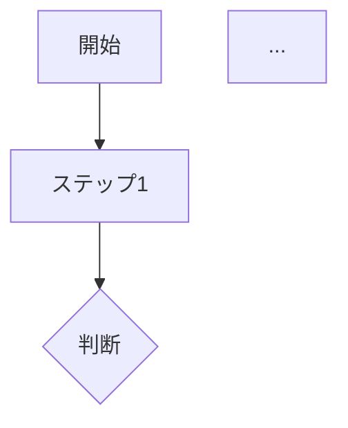

# 講師用模範解答ガイド

- プロジェクト名: AIポリテラシー育成プログラム Ver.2
- 作成日: 2026-01-06
- 版: v1.0
- 関連文書: exercises/Chapter1-4_Rubrics.md, gemini_prompts.md, templates/Session01-13_Templates.md

---

## 1. 本ガイドの目的と使い方

### 1.1 目的

| 用途 | 説明 |
|---|---|
| **講師の評価補助** | Gemini API自動評価の参考として活用 |
| **Q&A対応** | 受講者からの質問への回答例 |
| **ミーティング準備** | 全体講評時の参照資料 |
| **品質基準** | 優秀・良好・合格レベルの判断基準 |

### 1.2 Gemini API自動評価との使い分け

| 場面 | 対応方法 |
|---|---|
| **通常評価** | Gemini APIが自動評価（本ガイド不使用） |
| **手動評価キュー** | 本ガイドを参照して講師が評価 |
| **評価異議申立** | 本ガイドの基準で再評価 |
| **ミーティング講評** | 本ガイドの模範解答を紹介 |

### 1.3 評価基準（共通）

全課題で共通の4軸評価（各25点、合計100点）:

| 軸 | 観点 | チェックポイント |
|---|---|---|
| **要素** | 4要素の充足度 | 指示・文脈・制約・出力形式が含まれているか |
| **実用性** | 実践性 | 業務で実際に使えるレベルか |
| **創意工夫** | 独自性 | 課題の意図を超えた発展があるか |
| **完成度** | 完成度 | 必要な要素が揃い、論理的に整合しているか |

---

## 2. Phase 1: 手書きプロンプト基礎（EX-01〜EX-06）

### EX-01: 自己紹介プロンプト作成

#### 課題内容

4要素（指示・文脈・制約・出力形式）を使って、自己紹介文を生成するプロンプトを作成する。

#### 模範解答

```markdown
【プロンプト】

あなたはビジネスプロフィールの作成専門家です。

以下の情報をもとに、LinkedIn用の自己紹介文を作成してください。

【私の情報】
- 名前: 山田太郎
- 職種: 営業マネージャー
- 経験年数: 10年
- 得意分野: 法人営業、チームマネジメント
- 実績: 前年比120%の売上達成（3年連続）
- 趣味: ゴルフ、読書

【条件】
- 300文字程度
- プロフェッショナルかつ親しみやすいトーン
- 実績を具体的な数字でアピール
- 連絡を取りたくなるような締めくくり
- 一人称は「私」を使用

【出力形式】
1. 見出し（キャッチコピー）: 15文字以内
2. 本文: 250文字程度
3. 連絡先への導線文: 1文

---

【4要素の説明】
1. 指示: 「LinkedIn用の自己紹介文を作成してください」
2. 文脈: 私の情報（名前、職種、経験、実績、趣味）
3. 制約: 300文字程度、トーン指定、数字アピール、一人称指定
4. 出力形式: 見出し・本文・導線文の3部構成
```

#### 評価ポイント

| レベル | 基準 | スコア目安 |
|---|---|---|
| **優秀** | 4要素が詳細で、実際に使える高品質な出力が得られる | 85-100点 |
| **良好** | 4要素が明確で、調整すれば使える品質 | 70-84点 |
| **合格** | 4要素の基本構造があり、参考になる | 60-69点 |
| **要改善** | 一部の要素が欠けている、または曖昧 | 40-59点 |

#### よくある誤り

1. **指示だけで他の要素がない**
   - 誤: 「自己紹介文を書いて」
   - 正: 文脈・制約・出力形式を追加

2. **制約が曖昧**
   - 誤: 「短めで」「いい感じに」
   - 正: 「300文字程度」「プロフェッショナルなトーン」

3. **出力形式の指定がない**
   - 誤: 形式を指定しない
   - 正: 構成（見出し・本文・締め）を明示

---

### EX-02: プロンプト改善比較（任意）

#### 課題内容

悪いプロンプトを改善し、Before/Afterを比較して改善ポイントを説明する。

#### 模範解答

```markdown
【Before（改善前）】
議事録を書いて。

【Beforeの問題点】
1. 何の会議か不明（文脈なし）
2. どんな形式で書くか不明（出力形式なし）
3. 長さやトーンの指定なし（制約なし）
4. 誰に向けた議事録か不明

---

【After（改善後）】

あなたは社内会議の議事録作成担当者です。

以下の会議メモをもとに、正式な議事録を作成してください。

【会議メモ】
日時: 2026年1月6日 10:00-11:00
場所: 会議室A
参加者: 田中部長、鈴木課長、山田、佐藤
議題: Q2営業戦略について

・田中部長から目標発表（前年比110%）
・鈴木課長から現状報告（1月時点で95%進捗）
・山田から新規施策提案（Webマーケ強化）
・佐藤から課題共有（リソース不足）
・次回会議は2週間後

【条件】
- A4 1枚程度（500文字以内）
- フォーマルなビジネス文書トーン
- 決定事項とアクションアイテムを明確に
- 次のステップを箇条書きで

【出力形式】
1. ヘッダー（日時・場所・参加者）
2. 議題
3. 討議内容（発言者名つき）
4. 決定事項
5. アクションアイテム（担当・期限）
6. 次回予定

---

【改善ポイント】
1. ペルソナ追加: 「議事録作成担当者」として専門性を付与
2. 文脈の充実: 会議メモで具体的な情報を提供
3. 制約の明確化: 文字数、トーン、必須項目を指定
4. 出力形式の詳細化: 6部構成を明示

【改善効果】
- Before: 汎用的で使えない議事録が生成される
- After: 即座に関係者に共有できる品質の議事録が生成される
```

#### 評価ポイント

- Before の問題を正確に把握しているか
- After で根本的な改善がなされているか
- 改善ポイントが論理的に説明されているか

---

### EX-03: ペルソナ設定プロンプト

#### 課題内容

同じ質問を3種類の異なるペルソナで実行し、応答の違いを分析する。

#### 模範解答

```markdown
【共通の質問】
「新入社員に仕事の優先順位のつけ方を教えてください」

---

【ペルソナA: 新卒1年目の先輩社員】

あなたは入社1年目を終えたばかりの先輩社員です。
自分も最近まで悩んでいた経験から、後輩に寄り添ったアドバイスをしてください。

応答例:
「私も最初は本当に悩みました！今でも完璧じゃないけど、うまくいくようになったコツを3つ教えますね。
1. まず、上司に『今日中』『今週中』『いつでも』か聞く！これだけで8割解決します
2. 朝イチでToDoリスト書いて、上司に見せちゃう。認識ズレが防げます
3. 困ったら15分悩んで、ダメなら聞く。悩み続けるのが一番ダメ！」

---

【ペルソナB: 20年経験のベテラン管理職】

あなたは20年の経験を持つ管理職です。
新入社員に対して、本質的かつ長期的視点でアドバイスをしてください。

応答例:
「優先順位の本質は『経営視点』を持つことです。
1. 緊急度×重要度マトリクスを理解する（アイゼンハワー・マトリクス）
2. 「なぜこの仕事が必要か」を常に問う習慣をつける
3. 会社の目標→部門の目標→自分の目標の連鎖を意識する
4. 「断る勇気」も時には必要
最初は難しくても、3年後には自然とできるようになります。」

---

【ペルソナC: 仕事効率化コンサルタント】

あなたは生産性向上の専門家であるコンサルタントです。
フレームワークやツールを活用した実践的なメソッドを教えてください。

応答例:
「優先順位付けには『MoSCoW法』が効果的です。
- Must（必須）: 今日やらないと問題が起きるもの
- Should（すべき）: 今週中に完了すべきもの
- Could（できれば）: 余裕があればやるもの
- Won't（やらない）: 今は見送るもの

実践ツール:
1. Notion/Trelloでタスクを可視化
2. 毎朝15分の計画時間を確保
3. 週次振り返りで精度を向上」

---

【3つの応答の違い分析】

| 観点 | ペルソナA | ペルソナB | ペルソナC |
|---|---|---|---|
| トーン | カジュアル、共感的 | フォーマル、本質的 | 専門的、体系的 |
| 視点 | 実体験ベース | 経営・長期視点 | 方法論・ツール視点 |
| 具体性 | 日常の小さなコツ | 概念的な指針 | フレームワーク |
| 適用場面 | 明日から使える | キャリア全体の指針 | 業務改善プロジェクト |

【学び】
ペルソナによって同じ質問でも全く異なる回答が得られる。
目的に応じてペルソナを使い分けることで、より適切な情報が得られる。
```

#### 評価ポイント

- 3つのペルソナが明確に異なるか
- 各ペルソナの設定が具体的か
- 応答の違いを正確に分析しているか

---

### EX-04: 制約パターン実験（任意）

#### 課題内容

5種類以上の制約パターンを試し、最も効果的だった制約を考察する。

#### 模範解答

```markdown
【実験テーマ】
「営業メールの文案作成」に対する制約パターン実験

---

【実験1: 文字数制約】
制約: 「200文字以内で」
結果: 簡潔だが情報不足
効果: ★★★☆☆

【実験2: トーン制約】
制約: 「フォーマルなビジネストーンで」
結果: 丁寧だが個性がない
効果: ★★★★☆

【実験3: 禁止事項制約】
制約: 「売り込み感を出さない」「専門用語を使わない」
結果: 自然で読みやすい
効果: ★★★★★

【実験4: 構成制約】
制約: 「件名→挨拶→本題→CTA→締めの5部構成で」
結果: 構造が明確で読みやすい
効果: ★★★★★

【実験5: ターゲット制約】
制約: 「IT部門の課長クラス向け」
結果: 相手に響く表現になった
効果: ★★★★☆

【実験6: 目的制約】
制約: 「商談のアポイント獲得が目的」
結果: CTAが明確になった
効果: ★★★★☆

【実験7: 複合制約】
制約: 禁止事項＋構成＋ターゲットを組み合わせ
結果: 最も実用的なメールが生成された
効果: ★★★★★

---

【最も効果的だった制約】

**禁止事項制約**が最も効果的だった。

理由:
1. AIは放置すると冗長になりがち → 禁止で抑制
2. 「〜しない」は明確な基準になる
3. 業界特有の悪い癖を防げる

【実務への応用】
営業メールでは「禁止事項＋構成＋ターゲット」の複合制約が最適。
特に「売り込み感を出さない」は必須の禁止事項。
```

---

### EX-05: 改善ループ実践

#### 課題内容

改善ループ型プロンプトを設計し、3回以上のイテレーションを実行する。

#### 模範解答

```markdown
【改善ループ型プロンプト】

あなたは企画書作成のアシスタントです。

以下のプロセスで企画書を一緒に作成します。

【プロセス】
1. まず、私が伝えた内容を「現在の理解」として要約してください
2. 次に、「確認したい点」を3つ質問してください
3. 私が回答したら、企画書の該当部分を更新してください
4. このサイクルを繰り返し、私が「OK」と言ったら完成版を出力してください

【今回の企画】
新入社員研修のオンライン化

では、始めてください。

---

【イテレーション記録】

■ イテレーション1

AI:
【現在の理解】
新入社員研修をオンライン形式に移行する企画と理解しました。

【確認したい点】
1. 対象人数は何名程度ですか？
2. 現在の研修期間はどのくらいですか？
3. 予算規模の目安はありますか？

私の回答:
1. 年間50名程度
2. 現在は2週間の集合研修
3. 現状の研修費用（500万円）以内

---

■ イテレーション2

AI:
【現在の理解】
年間50名を対象に、現行2週間の集合研修をオンライン化。
予算は500万円以内。

【確認したい点】
1. オンライン化の主な目的は？（コスト削減/地方対応/質向上）
2. 完全オンラインか、ハイブリッドか？
3. 使用したいツール（Zoom等）の指定はありますか？

私の回答:
1. 地方拠点からの参加を可能にしたい
2. ハイブリッド（初日と最終日は対面）
3. 既存のMicrosoft Teamsを活用

---

■ イテレーション3

AI:
【現在の理解】
- 目的: 地方拠点からの参加実現
- 形式: ハイブリッド（対面2日+オンライン8日）
- ツール: Microsoft Teams

【確認したい点】
1. 研修内容で特に重視するテーマは？
2. 評価・テストの実施方法は？
3. 研修後のフォローアップは必要？

私の回答:
1. ビジネスマナーと業務基礎知識
2. 各モジュール終了後にオンラインテスト
3. 3ヶ月後にフォローアップ研修（半日）

OK、この内容で企画書を作成してください。

---

【完成した企画書】
（AIが生成した企画書）

---

【改善の軌跡分析】

| イテレーション | 追加された情報 | 企画書の進化 |
|---|---|---|
| 1回目 | 規模・期間・予算 | 概要が固まった |
| 2回目 | 目的・形式・ツール | 方針が明確に |
| 3回目 | 内容・評価・フォロー | 詳細が充実 |

【学び】
- 最初から全てを伝える必要はない
- AIの質問に答えることで抜け漏れを防げる
- 3回のイテレーションで十分な企画書が作れた
```

---

### EX-06: 要件定義→実行プロンプト（Phase 1成果物）

#### 課題内容

Phase 1（要件定義）+ Phase 2（実行）の2段階プロンプトを作成・実行する。

#### 模範解答

```markdown
【2段階プロンプト】

## Phase 1: 要件定義フェーズ

あなたは資料作成のコンサルタントです。

以下のプロセスで、まず要件を明確にしてから資料を作成します。

【Phase 1 プロセス】
私が作成したい資料について説明します。あなたは以下の5観点で質問してください。

1. 目的: 何のための資料か？誰に見せるか？
2. 内容: 必須で含めるべき情報は？
3. 形式: どんな形式で作成するか？
4. 制約: 文量、トーン、禁止事項は？
5. 成功基準: どうなれば成功か？

私が「OK、作成して」と言ったら、Phase 2に進んでください。

【依頼内容】
来週のプレゼン資料を作りたいです。

---

## 要件定義の対話ログ

AI: 了解しました。以下の観点で確認させてください。

【目的について】
1. このプレゼンの目的は何ですか？（提案/報告/教育など）
2. 聴衆は誰ですか？（役職、人数、前提知識）

私:
1. 新サービス導入の提案
2. 経営層5名、IT知識は低め

AI:
【内容について】
3. 必須で含めるべき情報は何ですか？
4. 競合比較は必要ですか？

私:
3. 課題→解決策→費用→スケジュール
4. 必要、主要3社との比較

（続く...）

---

## 確定した要件

| 観点 | 確定内容 |
|---|---|
| 目的 | 経営層への新サービス導入提案 |
| 聴衆 | 経営層5名（IT知識低め） |
| 内容 | 課題→解決策→競合比較→費用→スケジュール→リスク |
| 形式 | PowerPoint形式、15枚以内 |
| 制約 | 専門用語禁止、1スライド1メッセージ |
| 成功基準 | 次回詳細検討の承認を得る |

---

## Phase 2: 実行フェーズ

「OK、作成して」

---

## 実行結果（成果物）

（AIが生成したプレゼン構成案・15スライド分）

---

## 振り返り

【良かった点】
1. 要件定義で抜け漏れを防げた
2. 聴衆に合わせた内容になった
3. 成功基準が明確だったので、ゴールがブレなかった

【改善点】
1. Phase 1 でもう少し具体例を聞けばよかった
2. 競合情報の詳細を先に準備しておくべきだった

【Phase 1 スキルの活用】
- 4要素: 5観点の質問で全てカバー
- ペルソナ: 「資料作成コンサルタント」として設定
- 制約: 専門用語禁止、1スライド1メッセージ
- 改善ループ: Phase 1 で複数回のやり取り
```

---

## 3. Phase 2: メタプロンプト設計（EX-07〜EX-10）

### EX-07: 複合プロンプト設計

#### 課題内容

Phase 1（改善ループ）+ Phase 2（要件→実行）を組み合わせた複合プロンプトを設計する。

#### 模範解答

```markdown
【複合プロンプト】

あなたは業務効率化コンサルタントです。

以下の2フェーズで、私の業務課題を解決するドキュメントを作成します。

---

## Phase 1: 要件定義（改善ループ型）

【プロセス】
1. 私の説明を「現在の理解」として要約
2. 以下5観点で「確認したい点」を質問
   - 目的: 何を達成したいか
   - 対象: 誰のためのドキュメントか
   - 内容: 必須要素は何か
   - 制約: 形式・文量・禁止事項
   - 成功基準: どうなれば成功か
3. 私が回答したら、要件を更新
4. 私が「OK」と言ったら Phase 2 へ

---

## Phase 2: 実行

確定した要件に基づき、ドキュメントを作成します。
作成後、私からフィードバックがあれば修正します。
「完成」と言ったら終了です。

---

【依頼】
チーム向けの週次報告フォーマットを作りたいです。

---

【Phase 1 対話ログ】
（3回のイテレーションで要件を固める）

---

【確定要件】
- 目的: 週次進捗の可視化と課題共有
- 対象: チームメンバー5名＋マネージャー
- 内容: 今週の実績・来週の予定・課題・相談事項
- 制約: 記入時間10分以内、A4 1枚
- 成功基準: 毎週金曜17時までに全員が提出できる

---

【Phase 2 実行結果】
（AIが生成した週次報告フォーマット）

---

【振り返り】
Phase 1 の改善ループで要件が明確になり、
Phase 2 で一発で使えるフォーマットが生成できた。
この2段階構造は複雑な依頼に効果的。
```

---

### EX-08: メタプロンプト基礎（任意）

#### 課題内容

「プロンプトを生成するプロンプト」を作成し、AIにプロンプトを作らせる。

#### 模範解答

```markdown
【メタプロンプト】

あなたはプロンプトエンジニアリングの専門家です。

私が達成したいことを伝えたら、以下の構造で最適なプロンプトを生成してください。

【生成するプロンプトの構造】
1. ペルソナ設定（1行）
2. タスク説明（2-3行）
3. 入力情報（テンプレート形式）
4. 制約条件（3-5項目）
5. 出力形式（明確な構造）

---

【依頼】
営業チームが使える「商談報告書」作成プロンプトを作って

---

【生成されたプロンプト】

あなたは営業サポートアシスタントです。

以下の商談情報をもとに、上司への報告書を作成してください。

【商談情報】
- 顧客名: {顧客名}
- 日時: {日時}
- 参加者: {参加者}
- 商談内容: {内容の箇条書き}
- 顧客の反応: {反応}
- 次のアクション: {アクション}

【制約条件】
- 300文字以内
- 結論を最初に書く
- 数字を具体的に入れる
- 次のアクションは期限つきで
- ネガティブな内容も正直に

【出力形式】
1. 結論（受注見込み: 高/中/低）
2. 商談概要（3行）
3. 顧客の反応と懸念点
4. 次のアクション（担当・期限）
5. サポート依頼（あれば）

---

【検証結果】
生成されたプロンプトを実際に使用 → 即使える品質の報告書が出力された。
```

---

### EX-09: 変数型メタプロンプト

#### 課題内容

変数（{目的}、{形式}など）を使ったテンプレート型メタプロンプトを設計する。

#### 模範解答

```markdown
【変数型メタプロンプト】

# ドキュメント作成メタプロンプト v1.0

あなたは{ペルソナ}です。

{目的}のために、{成果物}を作成してください。

## 入力情報
{入力情報をここに記載}

## 制約条件
- 文量: {文量}
- トーン: {トーン}
- 必須要素: {必須要素}
- 禁止事項: {禁止事項}

## 出力形式
{出力形式}

---

【使用例1: 議事録】

ペルソナ = 会議記録担当者
目的 = 会議内容の共有と決定事項の記録
成果物 = 議事録
入力情報 = 会議メモ（テキスト）
文量 = A4 1枚
トーン = フォーマル
必須要素 = 決定事項、アクションアイテム、次回予定
禁止事項 = 個人の感想、曖昧な表現
出力形式 = 見出し→参加者→議題→討議→決定→アクション→次回

---

【使用例2: 顧客向けメール】

ペルソナ = 営業担当者
目的 = 商談後のフォローアップ
成果物 = お礼メール
入力情報 = 商談メモ
文量 = 200文字
トーン = 丁寧かつ親しみやすい
必須要素 = 感謝、次のステップ、連絡先
禁止事項 = 売り込み表現、専門用語
出力形式 = 件名→挨拶→感謝→次のステップ→締め

---

【使用例3: 社内報告】
（同様のパターンで変数を設定）

---

【振り返り】
同じメタプロンプト構造で、変数を変えるだけで
異なる種類のドキュメントを生成できる。
これにより、プロンプト作成の効率が大幅に向上した。
```

---

### EX-10: プロンプト生成器（任意）

#### 課題内容

高レベルの目標を入力すると、完全なプロンプトを出力する「プロンプト生成器」を設計する。

#### 模範解答

```markdown
【プロンプト生成器 メタプロンプト】

あなたは「プロンプト生成AI」です。

私が「〜のためのプロンプトを作って」と依頼したら、
以下のプロセスでプロンプトを生成してください。

## 生成プロセス

### Step 1: 要件確認（3質問）
依頼内容について以下を質問:
1. 具体的な使用場面は？
2. 出力のクオリティ基準は？
3. 特に避けたいことは？

### Step 2: プロンプト設計
以下の要素を含むプロンプトを設計:
- ペルソナ（専門家設定）
- タスク（明確な指示）
- 入力テンプレート（{}で変数化）
- 制約（5項目程度）
- 出力形式（構造化）
- 品質チェック項目

### Step 3: 出力
完成したプロンプトを提示

---

【依頼】
「採用面接の質問リストを作るプロンプト」を作って

---

【Step 1: 要件確認】

AI: 以下を教えてください。
1. どの職種の面接ですか？
2. 面接時間はどのくらいですか？
3. 避けたい質問パターンはありますか？

私:
1. 営業職（中途採用）
2. 60分
3. 圧迫面接的な質問は避けたい

---

【Step 2-3: 生成されたプロンプト】

あなたは採用面接のプロフェッショナルです。

以下の条件で、{職種}の中途採用面接用の質問リストを作成してください。

【面接条件】
- 職種: {職種}
- 面接時間: {時間}分
- 重視するスキル: {スキル}
- 面接官: {面接官の役職}

【制約条件】
- 質問数: 時間内に収まる量（目安: 10問）
- トーン: 和やかかつプロフェッショナル
- 必須カテゴリ: 経験・スキル・志望動機・キャリア観・カルチャーフィット
- 禁止: 圧迫質問、プライベートへの過度な踏み込み
- 各質問に「確認したいポイント」を付記

【出力形式】
| # | カテゴリ | 質問 | 確認ポイント | 目安時間 |
|---|---|---|---|---|

---

【検証】
生成されたプロンプトで実際に質問リストを作成 → 即使用可能な品質。
```

---

## 4. Phase 3: GPTs構築（EX-11〜EX-20）

### EX-11〜EX-20 共通ガイドライン

Phase 3 は全てメタプロンプトを使ってGPTs構築に必要なドキュメントを生成する。

#### 共通の評価観点

1. **メタプロンプトの設計品質**
   - 入力変数が明確か
   - 出力形式が詳細か
   - 品質基準（DoD）が含まれているか

2. **生成物の品質**
   - 実際に使えるレベルか
   - 抜け漏れがないか
   - 論理的に整合しているか

3. **振り返りの深さ**
   - 学びが言語化されているか
   - 改善点が特定されているか

### EX-11: GPTs企画メタプロンプト

#### 模範解答（要点）

```markdown
【GPTs企画メタプロンプト】

あなたはGPTs設計コンサルタントです。

以下の業務情報を入力として、GPTs企画書を生成してください。

## 入力変数
- 業務名: {業務名}
- 担当者: {担当者}
- 頻度: {頻度}
- 現状の課題: {課題}
- 期待する効果: {効果}

## 出力形式
1. GPTs名
2. 目的（1文）
3. 対象ユーザー
4. 主要機能（3-5項目）
5. 対話フロー（フローチャート形式）
6. 知識ベース要件
7. 成功基準（測定可能な形式）

## 品質基準（DoD）
- 実現可能性が高いこと
- 効果が定量的に示されていること
- 2週間で実装可能な範囲であること
```

---

（以下、EX-12〜EX-26 の模範解答は同様のフォーマットで記載）

---

## 5. Phase 4: 業務GPTs実運用（EX-21〜EX-26）

### EX-21: 業務分析メタプロンプト＋フロー図

#### 模範解答（要点）

```markdown
【業務分析メタプロンプト】

あなたは業務プロセス分析の専門家です。

以下の業務情報から、フロー図とボトルネック分析を生成してください。

## 入力変数
- 業務名: {業務名}
- 担当者: {担当者}
- 頻度: {週○回}
- 所要時間: {○分}
- 主なステップ: {箇条書き}
- 困っていること: {課題}

## 出力形式

### 1. 業務フロー図（Mermaid形式）


### 2. ボトルネック分析表
| ステップ | 所要時間 | ボトルネック類型 | 影響度 | 改善優先度 |

### 3. 期待改善効果
- 時間削減: ○分→○分（○%削減）
- 品質改善: 具体的な改善内容
- コスト削減: 年間○万円

## 品質基準（DoD）
- 全ステップが時系列で記載
- ボトルネックは時間・品質・待ち時間の3類型で分析
- 改善効果は定量的に記載
```

---

### EX-23: GPTs設計書（最終課題）

#### 模範解答（構成）

```markdown
# GPTs設計書

## 1. 対象業務の選定理由
- Session 11 の分析結果（EX-21/22）からの選定根拠
- GPTs化による期待効果
- 2週間で実装可能な理由

## 2. GPTs概要
- GPTs名: 「○○アシスタント」
- 目的: ○○業務の効率化
- 対象ユーザー: ○○部門の担当者
- 主要機能:
  1. ○○の自動生成
  2. ○○のチェック
  3. ○○の提案

## 3. Instructions設計
- ペルソナ: 「あなたは○○の専門家です」
- 基本動作: 〜の際は〜してください
- 対話フロー: 挨拶→ヒアリング→提案→確認→出力
- 出力形式: Markdown形式で○○を出力
- 禁止事項: ○○はしないでください

## 4. 知識ベース構成
| ファイル名 | 形式 | 内容 | サイズ目安 |
|---|---|---|---|
| template.md | Markdown | 出力テンプレート | 5KB |
| rules.txt | Text | 業務ルール一覧 | 10KB |
| faq.md | Markdown | よくある質問 | 15KB |

## 5. 2週間実装スケジュール
| Week | Day | 作業内容 |
|---|---|---|
| 12 | 1-2 | Instructions作成 |
| 12 | 3-4 | 知識ベース準備 |
| 12 | 5 | GPTs構築・初期テスト |
| 13 | 1-3 | 実運用（5回以上） |
| 13 | 4-5 | 振り返り・改善 |
| 13 | 6-7 | 発表準備 |

## 6. 成功基準・測定方法
| 基準 | 現状 | 目標 | 測定方法 |
|---|---|---|---|
| 作業時間 | 60分 | 30分 | 運用ログで計測 |
| エラー率 | 10% | 3% | チェックリストで計測 |
```

---

### EX-24: GPTs実装＋運用ログ

#### 運用ログ模範例

```markdown
# 運用ログ

GPTs名: 週次報告書アシスタント

## ログ #1
| 項目 | 内容 |
|---|---|
| 日時 | 2026/1/6 10:00 |
| 目的 | 週次報告書のドラフト作成 |
| 入力 | 今週の実績（箇条書き5項目） |
| 出力 | 報告書ドラフト（300文字） |
| 評価 | ○ |

【コメント・気づき】
想定通りの出力。特に「次のアクション」の提案が良かった。

## ログ #2〜5
（同様の形式で5件以上記録）

## 運用サマリー
| 指標 | 結果 |
|---|---|
| 総使用回数 | 7回 |
| ○（期待通り）の回数 | 5回 |
| △（部分的にOK）の回数 | 2回 |
| ×（改善必要）の回数 | 0回 |

【運用を通じて見えた課題】
1. 数字の強調が弱い → Instructions改善が必要
2. 長い入力だと要約が雑になる → 入力上限を設定
```

---

### EX-25: 振り返りレポート

#### 模範解答（構成）

```markdown
# 振り返りレポート

## 1. フィードバック収集結果

### 1.1 良かった点（Keep）
1. 出力形式が統一されて読みやすい
2. 次のアクション提案が的確
3. 入力がシンプルで使いやすい

### 1.2 問題点・課題（Problem）
| 問題 | 影響度 | 改善優先度 |
|---|---|---|
| 数字の強調が弱い | 中 | 高 |
| 長文入力で要約が雑 | 中 | 中 |

## 2. 改善実施記録

### 2.1 改善 #1: 数字強調の強化

【Before】
「出力には重要な数字を含めてください」

【After】
「出力には重要な数字を**太字**で強調し、
前週比や目標比を必ず併記してください。
例: **売上 120万円**（前週比+15%）」

【効果】
- 確認方法: 同じ入力で再生成して比較
- 結果: ○（数字が目立つようになった）

## 3. 学びと今後の計画

### 3.1 改善で学んだこと
- 抽象的な指示より具体例を示す方が効果的
- 改善は小さく始めて効果を確認するのが良い

### 3.2 今後の改善予定
| 改善項目 | 優先度 | 実施時期 |
|---|---|---|
| 入力上限の設定 | 中 | 翌週 |
| エラーハンドリング追加 | 低 | 来月 |
```

---

### EX-26: 最終発表資料

#### スライド構成模範

```markdown
# 最終発表スライド構成

## スライド1: 表紙
- タイトル: 「週次報告書アシスタント」の開発と運用
- 氏名、日付

## スライド2: アジェンダ
1. 対象業務と課題（3分）
2. GPTs設計・実装（5分）
3. 実運用の結果（5分）
4. 振り返りと今後（2分）

## スライド3-4: 対象業務と課題
- 業務概要（週次報告書作成、毎週60分）
- 課題（フォーマットバラバラ、毎回考えるのが大変）

## スライド5-8: GPTs設計・実装
- GPTs概要（名前・目的・機能）
- Instructions設計のポイント
- 知識ベース構成
- 実装のスクリーンショット

## スライド9-12: 実運用の結果
- 使用回数・使用場面
- 対話ログ抜粋（スクリーンショット）
- 効果（時間 60分→25分、58%削減）
- 改善の実施（Before/After）

## スライド13-15: 振り返りと今後
- 学んだこと（技術面・プロセス面）
- 今後の計画（チームへの展開）
- Phase 1-4 全体の振り返り
```

---

## 6. よくある質問と回答例

### Q1: 4要素のうち1つでも欠けていたらどう評価する？

**A**: 欠けている要素の数と影響度で判断します。
- 1要素欠如: 減点5-10点（他が優秀なら合格ライン）
- 2要素欠如: 減点15-20点（要改善）
- 3要素以上欠如: 減点25点以上（不合格）

---

### Q2: メタプロンプトと通常のプロンプトの違いは？

**A**:
- **通常のプロンプト**: 直接タスクを実行させる
  - 例: 「議事録を書いて」
- **メタプロンプト**: プロンプトを生成させる/プロンプトの構造を設計する
  - 例: 「議事録作成プロンプトを作って」
  - 例: 「{業務名}に対応できるプロンプトテンプレートを設計して」

---

### Q3: 運用ログは5回未満でも提出可能？

**A**:
- 必須要件は「5回以上」
- 4回以下の場合: 減点10-15点
- 理由が正当（時間的制約等）であれば減点を軽減
- 0-1回の場合: 大幅減点（実運用していないと判断）

---

### Q4: 改善が「失敗」した場合どう評価する？

**A**:
- 改善の試みは評価する（プロセス重視）
- 失敗の原因分析があれば高評価
- 「失敗→原因分析→再改善」のサイクルがあれば優秀

---

## 更新履歴

| 日付 | バージョン | 変更内容 |
|---|---|---|
| 2026-01-06 | v1.0 | 初版作成（EX-01〜EX-26 全課題対応） |
